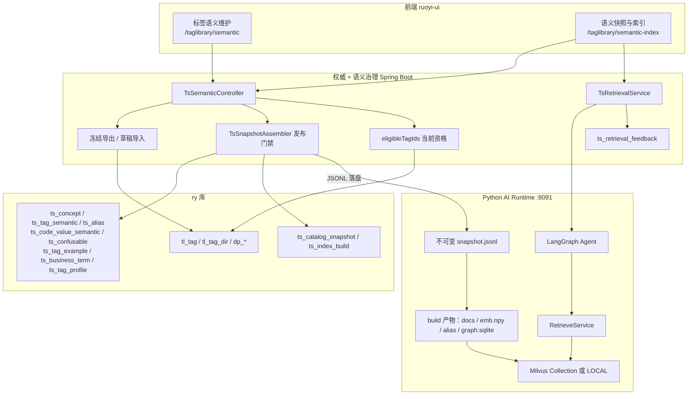
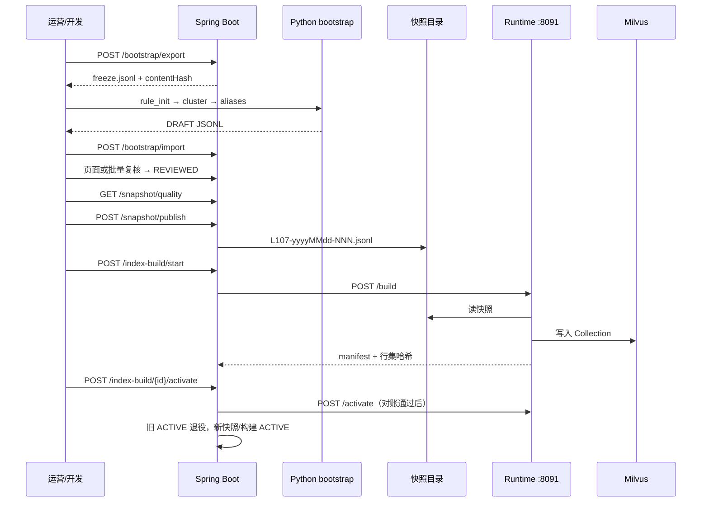
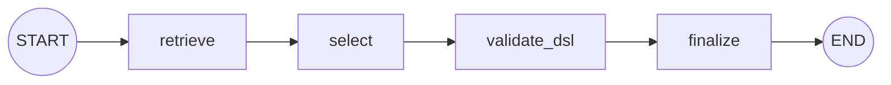
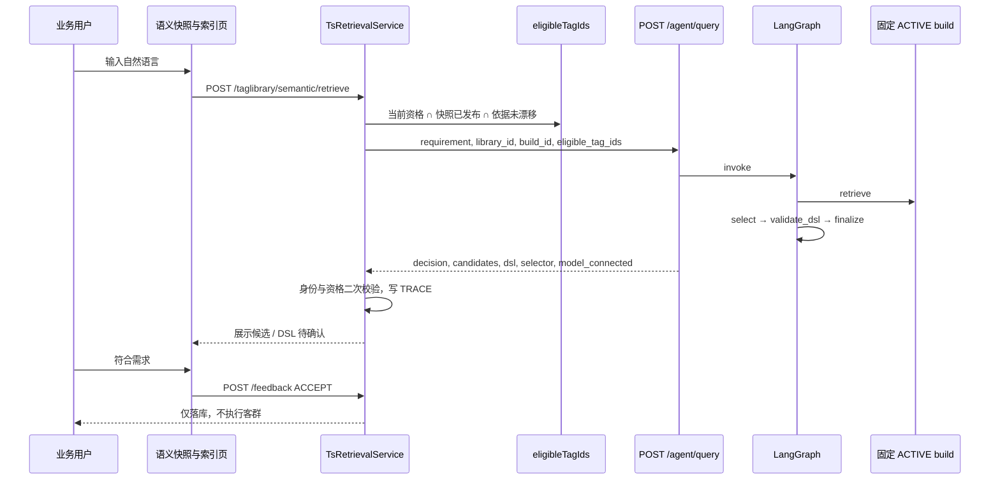

# 标签语义引擎与 Agent 编排层

> 对照代码事实整理（2026-09-19）。设计原稿见 [`../design/标签语义层与检索索引建设方案.md`](../design/标签语义层与检索索引建设方案.md)；本地演示验收见 [`../validation/语义索引层建设验收记录.md`](../validation/语义索引层建设验收记录.md)。
>
> 本文描述**已落地能力**与**如何使用**。当前 `ACTIVE` 只表示本机演示链路打通，不等于银行人工终验或生产运维批准。

---

## 0. 一句话定位

标签语义引擎把「标签是谁、能不能用」和「标签怎么被理解」拆开：权威身份仍在 `tl_tag` / `dp_*`，理解层在 `ts_*`。Python AI Runtime 只消费不可变快照和 Java 算好的资格集合，做检索、受限选择和 DSL 校验。页面上的自然语言查询走 LangGraph Agent，结果一律 `auto_execute=false`，必须人工确认，**不会自动圈客**。

---

## 1. 在整套标签系统中的位置

既有四大模块（数据代理 / 标签库 / 对象群 / 审批）负责接入、发布、圈客。语义引擎是叠在标签库之上的第五条能力链：

| 层 | 模块 | 职责 | 不负责 |
|---|---|---|---|
| 物理层 | `indiv_cust` 宽表 + 标准码表 | 客户取值、码义原文 | 检索、权限 |
| 权威层 | `dp_*` + `tl_*` | 数据源、数据集、标签身份、上线、来源确认 | 别名、族、检索文档 |
| 语义层 | `ts_*` | 概念、族、结构化口径、别名、码值语义、词典 | 改宽 `tl_tag`、替代审批 |
| 版本层 | `ts_catalog_snapshot` / `ts_index_build` | 不可变 JSONL、索引构建登记 | 权限白名单 |
| 运行时 | Python `ai-runtime/tag_semantic` | Embedding、Milvus、多路召回、Agent、DSL | 登录、资格、客群 SQL |
| 编排入口 | Vue「语义快照与索引」+ Java `TsRetrievalService` | 查询、Trace、反馈 | 自动执行对象群 |

权限永远在请求时由 Spring Boot 计算。快照和索引里没有角色、没有白名单。

---

## 2. 当前建设事实

### 2.1 已落地

| 能力 | 代码位置 | 本地演示基线 |
|---|---|---|
| 11 张 `ts_*` 表 + 菜单 2140–2146 | `sql/migration/V20260918_01/02`、`V20260919_01/02` | 库 107 已用 |
| 语义草稿维护 / 复核 / 导入导出 | `TsSemanticController`、`TsSemanticServiceImpl`、`TsBootstrapExportService` | 页面「标签语义维护」 |
| 规则初始化 + 概念归并 + 别名/易混淆 | `bootstrap/rule_init.py` 等 | 全量草稿可生成 |
| 本地 AI 专家复核包（非银行签字） | `bootstrap/expert_review.py`、`TsSemanticBatchReviewService` | `AI_EXPERT_LOCAL_DEMO` |
| 发布门禁 + JSONL 落盘 | `TsSnapshotAssembler`、`TsSnapshotArtifactStore` | `L107-20260919-002` |
| BGE-M3 + reranker + Milvus | `index/builder.py`、`index/milvus_store.py` | `bge-m3-l107-20260919-002-r3`，3374 文档 / 1024 维 |
| 六通道检索（别名 / BM25 名 / BM25 正文 / 稠密 / 族 / 码值） | `retrieve/service.py` | 精确别名可走快路径 |
| LangGraph Agent + AudienceQueryDSL | `agent/graph.py`、`agent/dsl.py` | `retrieve → select → validate → finalize` |
| Java ↔ Python 受控调用 | `TsRuntimeClient`、`server.py` | Bearer 令牌，Python 无公开文档页 |
| 自然语言查询页 + 反馈入库 | `semantic-index/index.vue`、`TsRetrievalService` | 查询走 `/agent/query` |
| 600 题本地封存回归 | `eval/acceptance.py` | 点估计通过，不是独立 Gold |

### 2.2 明确未完成或不得宣称

- 银行在岗人员签署：`human_bank_signoff=false`。
- 独立第三方 600 题 Gold：当前封存集由已复核快照构造。
- 生成式大模型：未配置时 `model_connected=false`，走精确证据离线选择器，不得冒充 LLM。
- Agent **没有** Deep Agents / 子智能体 / LangGraph `interrupt()`；人工确认在 Vue + Java 反馈。
- DSL **不会**调用对象群 SQL。合法 DSL 也只是待确认候选。
- `llm_enrich.py` 生产路径仍以护栏 + stub 为主，禁止 LLM 改写单位、区间、统计口径等事实字段。
- 历史通道「规则 / 反馈纠错」尚未成为独立召回实现；反馈只入库，不自动改别名。

---

## 3. 标签语义引擎：功能层级



### 3.1 权威层（Java，可变）

- `tl_tag`：标签身份、中文名、类型、发布状态、来源指纹。对象键 `CUST_ID` 不进业务检索。
- `dp_dataset` 在线版本启用字段：当前能不能用。
- 库级绑定的外部标准码表（经 `tl_tag_library_dimension` → `dp_dimension_table`）：码义权威。**不读**旧表 `tl_tag_code_value`。
- `POST /bootstrap/export`：同批冻结 `meta / domain / tag / code_value` JSONL，带 `source_manifest`。来源有问题则拒绝，不静默降级。

### 3.2 语义资产层（`ts_*`，高变更）

| 对象 | 表 | 作用 |
|---|---|---|
| 业务概念 | `ts_concept` | 稳定 `concept_code`；业务概念 → 标签族 → 标签 |
| 标签语义 | `ts_tag_semantic` | 与 `tl_tag` 1:1；语义类型、允许操作符、结构化口径、`family_key`、`basis_hash` |
| 别名 | `ts_alias` | TAG / CONCEPT / CODE_VALUE；至少 3 条已复核别名才能发布 |
| 码值语义 | `ts_code_value_semantic` | 区间、层级、未知桶；码值始终字符串 |
| 易混淆 | `ts_confusable` | 时间面 / 来源 / 近名等消歧 |
| 正反例 | `ts_tag_example` | 检索文档补充 |
| 模糊词典 | `ts_business_term` | 「最近 / 大额 / 至少」等；ASK 则澄清 |
| 安全画像 | `ts_tag_profile` | 仅 LOW 敏感、样本量≥20 的聚合摘要可进快照 |

内容带 `source`（RULE / LLM / HUMAN / FEEDBACK / SYNC）和 `review_status`（DRAFT / REVIEWED）。修改已复核内容必须回落 DRAFT。`basis_hash` 对不上权威冻结则发布失败。

`family_key` 六段：`concept_code|statistic|scope|source_system|unit|caliber_variant`。空位写 `NONE`。同一族才能按时间锚点选成员，否则 Agent 澄清。

语义类型决定操作符：

| 类型 | 允许操作符（规则初始化默认） |
|---|---|
| BOOL | `=` |
| ENUM_NOMINAL / ENUM_ORDINAL | `=`, `in`, `not_in` |
| ENUM_HIERARCHY | `=`, `in` |
| NUM_AMOUNT / NUM_COUNT / NUM_RATIO / NUM_SCORE | `>`, `>=`, `<`, `<=`, `between` |
| DATE | `=`, `>`, `<`, `between` |
| TEXT_FREE | `like`, `contains` |
| ID_KEY | 空，不进快照 |

### 3.3 版本层（不可变）

发布时 Java 用**同一批冻结**做门禁、组装、落盘：

1. 复核状态、概念祖先启用、依据未漂移、族键合法、核心口径齐、别名≥3、码值齐、完整度≥70。
2. 写出 `kind ∈ {meta, domain, concept, tag, code_value, term}` 的 JSONL。别名/易混淆/示例外挂在 tag/concept 行上。
3. `content_hash` = 规范化内容哈希；`file_sha256` = 文件字节哈希。下载头分别返回两者，不可混比。
4. 快照状态：`PUBLISHED` →（索引激活后）`ACTIVE` → `RETIRED`。

索引构建绑定 `snapshot_id + build_id + 模板 tpl1 + Embedding/Reranker 指纹 + 检索配置哈希`。换模型必须新 `build_id`，禁止原地覆盖。

### 3.4 索引与检索层（Python）

构建产物目录（`TAG_INDEX_DIR/<build_id>/`）：

- `snapshot.jsonl`、`docs.jsonl`、`emb.npy`
- `alias_automaton.json`（进程内别名检索）
- `graph.sqlite`（域 → 概念 → 族 → 标签 → 码值）
- `manifest.json`（身份、指纹、行集 `doc_id_hash`）

检索文档模板 `tpl1` 为每个标签/概念/码值生成 `name_text / body_text / dense_text`，不是只索引标签名。

一次 `retrieve`：

1. 用词典解析时间锚点、边界词、否定、ASK 类模糊词。
2. 资格集合为空 → 直接空结果，不降级全库。
3. 别名命中；若最长已复核别名唯一指向一个标签且非多条件，走精确快路径，跳过重排。
4. 否则四路召回：别名、BM25 名称、BM25 正文、稠密向量；RRF 融合；目录名只作极小软先验，不剪枝其他域。
5. 有 reranker 时对 Top 50 重排。
6. 概念文档展开为族内有资格标签；按时间面做族解析。
7. 枚举/布尔的码值必须来自已复核别名精确命中，不能把向量相似码当条件。
8. 有序分档仅当完整桶并集**严格等于**请求区间才可表达，否则 `INEXPRESSIBLE`（「超过 100 万」不得近似成「100 万及以上」）。

存储模式 `LOCAL` 与 `MILVUS` 必须显式选择，禁止自动降级。

---

## 4. 标签语义引擎：建设与查询数据流

### 4.1 建设流水线（离线 → 库内 → 可检索）



资格在检索时重算：当前上线且 AVAILABLE、字段仍在在线数据集中、快照内已发布、`basis_hash` 与当前冻结一致、概念未停用。对不上就从本次资格里拿掉，而不是用旧快照放行。

### 4.2 查询流水线（见下一节 Agent）

页面「查询标签」**不**调用 Python `/retrieve`。Java `TsRetrievalService.retrieve` 固定打 `/agent/query`。纯检索 HTTP 仍保留给运维和评测。

---

## 5. Agent 编排层：功能层级

Agent 是检索之上的**受控选择图**，不是通用对话智能体。



| 节点 | 做什么 | 不能做什么 |
|---|---|---|
| `retrieve` | 调 `RetrieveService`，只展开资格内可见候选 | 不读全库、不读客户原值 |
| `select` | 选择器在候选里建议 `decision / dsl / recommended_tag_ids` | 检索已判定 CLARIFY / INEXPRESSIBLE 时跳过 |
| `validate_dsl` | `AudienceQueryDSL` 校验资格、操作符、已发布码值 | 不改写条件、不执行 SQL |
| `finalize` | 汇总决策；`auto_execute=false`、`requires_confirmation=true` | 不写库、不圈客 |

### 5.1 两种选择器

| 选择器 | 何时启用 | 行为 |
|---|---|---|
| `openai-compatible:<model>` | 同时配置 `TAG_LLM_BASE_URL` + `TAG_LLM_MODEL` | 只发送最多 20 条已过滤候选的 tag_id/名称/定义/操作符/码值；要求 JSON：`decision, confidence, explanation, dsl` |
| `exact-evidence-offline` | 未配置模型（当前演示默认） | 仅当查询归一化后唯一命中一条已复核名称或别名；数值边界词可生成简单数值 DSL；否则返回空，由 finalize 变成候选或澄清 |

`model_connected` 仅当实际使用 OpenAI 兼容选择器时为 true。调用失败不得回退成「已连接 LLM」。

### 5.2 DSL 契约

```json
{
  "logic": "AND",
  "conditions": [
    { "tag_id": 1175, "operator": ">=", "value": 0 }
  ]
}
```

约束：1–20 条条件；`in / not_in / between` 用 `values`；枚举/布尔的值必须是快照里已发布码；`tag_id` 必须在本次 `eligible_tag_ids` 中。非法则 `REJECTED_BY_DSL_GATE`。

### 5.3 决策码（页面文案）

| decision | 含义 |
|---|---|
| `CANDIDATES_ONLY` | 有候选，需人工核对口径 |
| `NEEDS_CONFIRMATION` | DSL 已过门禁，仍须确认后才可交给客群服务 |
| `NEEDS_VALUE` | 标签已唯一识别，缺条件值 |
| `CLARIFY` | 时间/口径/模糊词不清 |
| `INEXPRESSIBLE` | 分档无法精确表达 |
| `REJECTED_BY_DSL_GATE` | 模型建议未过 DSL |

Java 在响应返回前再次校验：`snapshot_id / build_id / store_type / artifact_hash` 必须等于当前 ACTIVE bundle；候选 `tag_id` 必须 ⊆ 资格。然后写入 `action=TRACE`（查询原文只存 SHA-256）。用户点「符合需求」再写 `ACCEPT` 等决策行，且必须是**本人 Trace**。

---

## 6. Agent 编排层：请求数据流



服务间认证：Java `tag.runtime-token` 与 Python `TAG_RUNTIME_TOKEN` 必须相同。Python 不暴露 Swagger。用户 JWT 到不了 Python。

---

## 7. 使用指南

### 7.1 角色与菜单

| 权限 | 菜单/按钮 | 能做 |
|---|---|---|
| `taglibrary:semantic:list` | 标签语义维护、语义快照与索引 | 查看、查询、下载快照、看质量报告 |
| `taglibrary:semantic:edit` | 维护页保存 | 改 DRAFT |
| `taglibrary:semantic:review` | 业务复核 | DRAFT → REVIEWED（校验 basis_hash） |
| `taglibrary:semantic:bootstrap` | 导出冻结、导入草稿、建索引、聚合画像 | 建设期操作 |
| `taglibrary:semantic:publish` | 发布前检查、发布快照、激活索引 | 门禁与激活 |

路由：

- `/taglibrary/semantic` 标签语义维护
- `/taglibrary/semantic-index` 快照、索引、自然语言智能体

### 7.2 本机启动（演示）

依赖：MySQL、Redis、Milvus（默认 `http://127.0.0.1:19530`）。模型目录不进 Git，需本地：

```text
ai-runtime/out/models/bge-m3/
ai-runtime/out/models/bge-reranker-v2-m3/
```

```bash
# 安装（真实 BGE 用 3.12 独立环境）
uv sync --project ai-runtime --extra dev
UV_PROJECT_ENVIRONMENT=.venv-models uv sync --project ai-runtime --python 3.12 \
  --extra dev --extra models --frozen

# 终端 1：Python 运行时
export TAG_RUNTIME_TOKEN='<本地随机令牌>'
export TAG_RUNTIME_PYTHON='ai-runtime/.venv-models/bin/python'
export TAG_SNAPSHOT_DIR="$PWD/ai-runtime/out/full-20260919/snapshots"
export TAG_INDEX_DIR="$PWD/ai-runtime/out/full-20260919/indexes"
export TAG_EMBEDDING_PATH="$PWD/ai-runtime/out/models/bge-m3"
export TAG_RERANKER_PATH="$PWD/ai-runtime/out/models/bge-reranker-v2-m3"
export MILVUS_URI='http://127.0.0.1:19530'
./bin/tag-semantic-runtime.sh

# 终端 2：Java + Vue（令牌必须与终端 1 相同）
export TAG_RUNTIME_TOKEN='<与终端1相同>'
export TAG_SNAPSHOT_DIR="$PWD/ai-runtime/out/full-20260919/snapshots"
export TAG_LOCAL_DEMO_CURRENT_FREEZE='<实时冻结 JSONL 绝对路径>'
export TAG_LOCAL_DEMO_CURRENT_FREEZE_SHA256='<该文件 SHA-256>'
PORT=1024 ./dev.sh start
```

打开 `http://localhost:1024/taglibrary/semantic-index`，选「个人客户经营标签库」。

基线自检：

1. 表格出现 `L107-20260919-002 / ACTIVE / 969/969`。
2. 「发布前检查」：`excluded=[]`、均分约 94、最低 70。
3. 查询「上月借记卡消费金额至少0」→ 标签 1175，DSL 合法待确认，`大模型已连接=否`。
4. 「符合需求」→ 本人 Trace 写入 `ACCEPT`，不圈客。

隔离回归（不启停 Docker）：

```bash
bin/verify-tag-semantic.sh
VERIFY_UI=true bin/verify-tag-semantic.sh
```

未配置 `TAG_EMBEDDING_PATH` 时运行时拒绝启动，除非显式 `TAG_ALLOW_HASH_BASELINE=true`（仅基线实验）。

### 7.3 从零建设一条可查询链路

1. **冻结权威**  
   维护页「导出实时冻结」，或 `POST /taglibrary/semantic/bootstrap/export`。`issues` 非空则不要继续。

2. **生成 DRAFT**（Python，不连业务库）

   ```bash
   ai-runtime/.venv/bin/python -m tag_semantic.bootstrap.expand_full \
     path/to/freeze.jsonl --out-dir /tmp/semantic-drafts
   ```

   产出 `rule_init_result.jsonl`、概念复核包、别名、易混淆。全量扩展**禁止** `--review` 自动复核。

3. **导入草稿**  
   维护页工具栏「导入规则草稿」，选择 Python 产出的 `rule_init_result.jsonl`（或同等 `kind=concept/tag_semantic/code_value_semantic` 的 JSONL）；等价 API 为 `POST /taglibrary/semantic/bootstrap/import`。对象键不进业务概念。

4. **复核**  
   页面逐条复核，或建设期用 `TsSemanticBatchReviewService`（无跳过权限的 HTTP）。修改已 REVIEWED 的内容会回落 DRAFT。本地 AI 专家包会永久写入 `review_mode=AI_EXPERT_LOCAL_DEMO`，不能当成银行签字。

5. **发布前检查 → 发布快照**  
   索引页「发布前检查」看 `excluded`。通过后「发布快照」。文件在 `TAG_SNAPSHOT_DIR`。

6. **新建索引并激活**  
   选中快照 → 存储选 `MILVUS`（或对照用 `LOCAL`）→ 「新建索引」（可能数分钟）→ 行集对账通过后「激活」。只有 ACTIVE 构建承接查询。

7. **查询与反馈**  
   在同一页输入自然语言。结果必须人工确认。反馈动作：`ACCEPT / REPLACE / REMOVE / CLARIFY_PICKED / REJECT_ALL`。

### 7.4 接入真实 LLM 选择器

只把资格剪裁后的候选发给已批准的 OpenAI-compatible `chat/completions`。不发送客户原值、不发送整库快照。

| 环境变量 | 用途 |
|---|---|
| `TAG_LLM_BASE_URL` | 服务基地址（不含 `/v1` 后缀以外的自定义路径时，代码会拼 `/v1/chat/completions`） |
| `TAG_LLM_MODEL` | 已批准模型名 |
| `TAG_LLM_API_KEY` | 仅环境注入，不入库、不进 Git |

重启 Python 运行时后，页面必须显示 `model_connected=true` 才能把该次查询记为 LLM 结果。未配置或失败时保持精确证据模式。

### 7.5 常用 HTTP（均需登录权限；运行时另需服务令牌）

Java（浏览器 Axios 前缀 `/dev-api`）：

| 方法 | 路径 | 说明 |
|---|---|---|
| POST | `/taglibrary/semantic/retrieve` | 自然语言查询（内部转 Agent） |
| POST | `/taglibrary/semantic/feedback` | 本人 Trace 反馈 |
| GET | `/taglibrary/semantic/snapshot/active` | 当前 ACTIVE bundle |
| GET | `/taglibrary/semantic/eligible-tags` | 当前资格；取不到则拒绝服务 |
| GET | `/taglibrary/semantic/snapshot/quality` | 发布门禁预演 |
| POST | `/taglibrary/semantic/snapshot/publish` | 发布 |
| GET | `/taglibrary/semantic/snapshot/{id}/download` | JSONL；头含双哈希 |
| POST | `/taglibrary/semantic/index-build/start` | 构建 |
| GET | `/taglibrary/semantic/index-build/{id}/stats` | 行集对账 |
| POST | `/taglibrary/semantic/index-build/{id}/activate` | 激活 |

Python（`Authorization: Bearer $TAG_RUNTIME_TOKEN`）：

| 方法 | 路径 | 说明 |
|---|---|---|
| GET | `/health` | 探活（无令牌也可看是否配置） |
| POST | `/build` | 从快照目录构建 |
| POST | `/retrieve` | 纯检索 |
| POST | `/agent/query` | LangGraph |
| GET | `/stats?build_id=` | manifest + 行集对账 |
| POST | `/activate` `/deactivate` `/drop` | 仅 Java 协议调用 |

### 7.6 CLI 与评测

```bash
# 取 Java 快照（需 TAG_JAVA_TOKEN）
python -m tag_semantic.cli fetch-snapshot --base-url http://127.0.0.1:8080 \
  --snapshot-id L107-20260919-002 --out /tmp/snap.jsonl

# 离线构建
python -m tag_semantic.cli build --snapshot snap.jsonl --out indexes/b1 \
  --build-id b1 --store-type MILVUS \
  --embedding-path ai-runtime/out/models/bge-m3 \
  --reranker-path ai-runtime/out/models/bge-reranker-v2-m3

# 离线查询 / 开发评测
python -m tag_semantic.cli query --snapshot snap.jsonl --artifact indexes/b1 --text '女性'
python -m tag_semantic.cli eval --snapshot snap.jsonl --artifact indexes/b1

# 600 题封存回归（输出必须是新文件；hash 必须匹配）
ai-runtime/.venv-models/bin/python -m tag_semantic.eval.acceptance \
  --build-dir ai-runtime/out/full-20260919/indexes/bge-m3-l107-20260919-002-r3 \
  --sealed ai-runtime/out/full-20260919/eval/sealed-600-v2.json \
  --sha256 2c542a60b5a8124b855c89fd97465e13899f0848f7469fadb50d4cba934999d4 \
  --output /tmp/sealed-600-recheck.json
```

产物备份/重建（不激活）：`python -m tag_semantic.index.maintenance backup|rebuild ...`

### 7.7 配置项

| 配置 | 含义 |
|---|---|
| `tag.snapshot-dir` / `TAG_SNAPSHOT_DIR` | Java 与 Python 共用的快照目录 |
| `tag.runtime-url` / `TAG_RUNTIME_URL` | 默认 `http://127.0.0.1:8091` |
| `tag.runtime-token` / `TAG_RUNTIME_TOKEN` | 服务间令牌 |
| `tag.local-demo-current-freeze` + `...-sha256` | 本地演示用已导出冻结件做当前资格，避免回连来源库；路径与哈希必须成对 |

令牌、API Key、客户原值不得写入文档、验收 JSON 或 Git。

### 7.8 使用红线

1. 不改宽 `tl_tag` 来存别名或口径。
2. 不把权限写入快照或索引。
3. 空资格必须空结果。
4. 跨桶阈值不可近似。
5. 合法 DSL 也不得自动执行。
6. 封存测试题不得回流进别名、示例、LLM、反馈学习。
7. 本地 AI 专家复核 ≠ 银行签署。

---

## 8. 代码地图

| 关心的问题 | 先看 |
|---|---|
| HTTP 面 | `TsSemanticController`、`ai-runtime/tag_semantic/server.py` |
| 资格与激活 | `TsCatalogRuntimeServiceImpl` |
| 发布门禁 | `TsSnapshotAssembler` |
| 查询与反馈 | `TsRetrievalService` |
| 检索 | `retrieve/service.py`、`family.py`、`facets.py` |
| Agent / DSL | `agent/graph.py`、`agent/dsl.py` |
| 索引 | `index/builder.py`、`milvus_store.py`、`docs/templates.py` |
| 草稿生成 | `bootstrap/rule_init.py`、`expand_full.py`、`expert_review.py` |
| 页面 | `ruoyi-ui/src/views/taglibrary/semantic/`、`semantic-index/` |
| 本机命令 | `ai-runtime/README.md`、`bin/tag-semantic-runtime.sh` |
