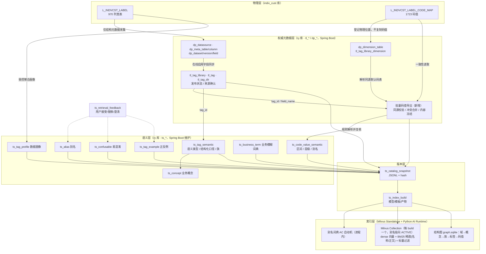

# 标签语义层与检索索引建设方案

> 所属：标签智能体 · 模块 A「高精度标签语义引擎」的基础数据架构
> 范围：标签语义层（元数据、别名、口径、码值、版本）+ 检索索引（版本快照、词典、BM25、向量、Milvus 选型与索引构建治理）
> 不含：查询理解 Prompt、受限选择、DSL 校验、LangGraph 编排（另文）
> 日期：2026-09-16；2026-09-17 评审修订（权威层事实、快照契约与检索边界）　状态：方案（已校准代码事实，运行态与选型 PoC 待验证）

---

## 0. 结论摘要

1. **在现有 `tl_*/dp_*` 之上新建 `ts_*` 语义层，不改宽 `tl_tag`。** `tl_tag` 负责标签身份、发布与已确认来源；`dp_*` 负责数据源、结构元数据、数据集版本和字段。`ts_*` 以 `tag_id` 连接，补充别名、结构化口径、码值语义、易混淆与示例，不替代权威校验。
2. **保留“业务概念 → 标签族 → 标签”三级。** 此前名称分析估计 969 个业务标签约 709 族，其中 171 个多成员族覆盖 431 标签；这是初始化参考，S2/S3 按统计方式、范围、来源及单位重新核验，不作为固定验收数。只有这些口径相同的标签才能按时间锚点选成员，否则澄清。
3. **快照即契约。** 不可变 JSONL 冻结标签、码值、语义与必要画像；索引绑定 `snapshot_id + build_id + 模型/模板/分析器版本`。请求固定同一 build，权限与当前可用性由 Spring Boot 动态校验，不依赖旧快照放行。
4. **码值是一等检索对象，但不再依赖 `tl_tag_code_value`。** 经库级默认码表关系读取外部标准码表，再关联 `(tag_id, code)` 的语义扩展并冻结。1723 是交付规模，实际以有效、已复核数据为准；分档只在完整区间并集可精确表达条件时转换为字符串编码集合，不能把“超过100万”偷换为“100万及以上”。
5. **保留 Milvus Standalone 为默认选型，能力与部署先过 PoC。** 每个库的每个 build 一个 Collection，别名用于运维定位，应用激活同时管理词典、结构图与模型；单次 `alter_alias` 不等于跨组件事务。Milvus 是可重建派生物；本地实现用于对照，只有同 build 降级产物预构建且验收通过才开放故障降级。
6. **流水线保持分阶段：** 核验码表与同源绑定 → 规则初始化/概念归并 → 安全画像 → LLM 草稿 → 人工复核 → 冻结输入与质量门禁 → 快照发布 → 索引构建、评测、激活。当前活动功能与新增开发任务在 §8 分开列明。

---

## 1. 现状与输入盘点

### 1.1 原始数据（`sql/indiv_cust/`，SQL 交付口径）

| 对象 | 事实与边界 |
|---|---|
| `indiv_cust.L_INDVCST_LABEL` | 970 列（`CUST_ID` + 969 个业务标签字段），一行一客户。969 个业务字段类型分布：TINYINT 129、TEXT 155、DECIMAL 449、INT 160、DATE 66、DATETIME 10。COMMENT 是原始中文名输入，不替代平台已审核的标签名/口径。 |
| `indiv_cust.L_INDVCST_LABEL_CODE_MAP` | 六列标准码表：`(tag_name_en, tag_code) PK, tag_name_cn, code_definition, code_sort, last_update_time`。脚本覆盖 177 字段、1723 码值：布尔 129×2=258；选项 42 字段 195 条（大量为业务推定）；机构 6 字段 1270 条公开联行号相关码值。公开联行号不等于已核验的行内组织层级。 |
| 码值特征 | 布尔 `1=是/0=否`；分类短字母码（M/F）；有序分档可用前导零数字码（`01/02/03`）。`tag_code` 始终按字符串保存，序关系、数值区间需另行复核，不能靠编码大小推断。 |

以上是交付脚本的结构与数量，不是当前数据库实测；脚本不参与自动部署，也不负责平台登记和标签库绑定。本次评审未连接数据库，不能据脚本中的“未执行”认定今天未入库；S0 应先核验现状，仅补齐缺项，不盲目重跑覆盖码值。

### 1.2 现有权威层（`ry` 库，代码事实与能力边界）

| 表/链路 | 当前作用与本方案用法 |
|---|---|
| `tl_tag_library` / `tl_tag` | 库关联数据集；标签保存身份、名称、类型、口径、发布版本及来源状态/指纹/快照，**不保存客户标签取值**。库 107“970 标签已上线、version=3”是此前盘点记录，实施前重查；其中对象键 `CUST_ID` 不进入业务检索，969 是预计检索规模。 |
| `tl_tag_dir` | 已支持 `parent_id` 多级目录树，不受两级限制。此前“9 个顶层含默认、55 个末级”仅是库 107 的目录盘点，不是模型约束；导出时内存构图生成路径。 |
| `tl_tag_library_dimension` → `dp_dimension_table` → 外部码表 | **当前码值主链路**：登记码表物理位置 → 库级绑定启用、未删除且与数据集同源的码表 → 按 `tag_name_en = tl_tag.field_name` 实时读取。`dp_dimension_table` 不存码值；冲突检查、圈群选项、码值校验、中文展示已消费此链路。大码表是否已绑定库 107 需查库，不能由旧测试 seed 推断。 |
| `tl_tag_code_value` | **旧链路残留，不是本方案码值权威**。旧接口仍可从宽表字段 `SELECT DISTINCT` 写入，初始中文定义等于 code，且删库仍会清理它；没有当前文档曾声称的 `source=SYNC/MANUAL` 字段。当前圈群主链路不读取它，不作为新语义层依赖，也不在本次实施中退役。 |
| `tl_tag_metadata_change` / `tl_audit_log` | 前者存名称/类型/目录/技术口径/业务口径的变更申请，后者存审批动作历史。首次映射审核通过只到标签草稿，不等于上线。语义层采用独立轻量复核，但不能绕过现有元数据与发布审批。 |
| `dp_datasource` / `dp_datasource_catalog` / `dp_datasource_log` | 数据源连接、目录与操作/同步日志；快照只取必要来源 ID，不导出连接口令。连接测试并无已实现的 TEST 日志写入保证。 |
| `dp_meta_table` / `dp_meta_column` | 从外部库采集的**结构元数据缓存**，不是客户明细，也不是永远新鲜的物理真相；表列同步与标签库字段同步是两步。 |
| `dp_dataset` / `dp_dataset_catalog` / `dp_dataset_version` / `dp_dataset_field` | 数据集定义、目录、版本与字段选择。复用现有解析：默认版本在线则优先，否则取版本号最大的 ONLINE；要求数据集启用且未删除。`tl_tag.field_name` 对应字段别名，物理列需通过当前启用字段解析。 |
| `dp_dataset_dependency` / `dp_dataset_log` | 前者在保存/复制版本时维护依赖快照，目前读取主要用于版本复制，**不是已建成的血缘/影响分析引擎**；后者记录操作。二者不承担检索资格或权限判定。 |
| `tl_object_group` / `tl_object_group_import` | 下游规则/SQL 与持久导入值；执行时另外建临时表。不是标签知识源，也不将导入客户值纳入语义快照。 |
| `dp_code_table/item/mapping/version` / `dp_asset_reference` | 五张历史无主表，当前初始化明确排除；不恢复、不接入，也不据此断言旧环境物理表已删除。 |

必须区分三种同步：① 外部结构 → `dp_meta_*`；② 在线数据集启用字段 → `tl_tag` 定义及来源状态；③ 旧接口宽表 DISTINCT → `tl_tag_code_value`。**②不搬运码值，③不读取标准码表中文定义**。新方案新增的是基于活动码表链路的批量导出、内容冻结与漂移校验，不是复用一个已存在的码值镜像同步功能。

`tl_tag.source_snapshot` 是最近同步观察到的来源记录，须结合 `source_status / source_fingerprint / confirmed_fingerprint` 及当前在线字段使用。`dp_dataset_field` 虽有 `sensitivity_level / expression_json / mask_rule` 等列，当前保存链路未维护或执行这些能力；不能直接当成可靠敏感等级、表达式或脱敏服务。代码证据见附录 C。

### 1.3 已定的技术决策（来自启动清单与课题材料）

- AI Runtime：Python 3.11+ / FastAPI / LangGraph，独立部署，通过 Spring Boot API 集成，权限与客群创建归原系统。
- 检索栈：多路召回（精确/别名/BM25/Embedding/规则/历史纠错）→ RRF → 可替换 Reranker → 候选内受限选择。
- 向量存储：保留 Milvus Standalone 为默认选型（§7.7），统一稠密/稀疏检索和标量过滤；它不替代服务端授权、完整产物管理或跨组件激活。当前规模并不要求向量数据库，收益与三容器运维成本通过 W1 PoC 评估。本地 numpy/rank_bm25 保留对照基线；Embedding / Reranker 在同一开发 Benchmark 上 A/B，封存测试集仅验收。
- 竞赛承诺：Recall@20、Auto Precision、Coverage、Query Exact Match 同时公布；幻觉标签、越权/未发布标签引用率为 0。

### 1.4 从三份参考文档提炼的硬约束

| 来源 | 约束 |
|---|---|
| 两大亮点方案 §3.2 | 标签知识质量是第一道防线；检索文本必须是"上下文化标签文档"而非标签名；置信度由可观测特征校准。 |
| NL2Tag 详解 §16 | 硬路由会截断正确字段 → 主题域只做软先验；向量结果必须门控；序语义不能共用 Top 40% 启发式 → 需字段级有序码值配置；数学边界词（以上/至少）需口径、解析、Benchmark 三处一致。 |
| OceanBase 语义网络 §5/§9/§10 | 语义层独立于物理层，Binding 用稳定 ID；图结构 + 字面索引 + 向量索引三种存储并存；大规模时"概览 → 业务域收敛 → 域内搜索"分级召回；Gold 集固定、按规模梯度加 hard negative 验证召回稳定性。 |

---

## 2. 设计目标与原则

### 2.1 目标

| 维度 | 目标 |
|---|---|
| 覆盖 | 969 标签 100% 具备：语义类型、结构化口径、≥3 条别名、允许操作符、检索文档；177 码值字段 100% 具备码值语义（布尔/分类/有序区间/层级）。 |
| 可复现 | 任一 Trace / 评测结果能回到 `(snapshot_id, index_build_id, doc_template_version)`。 |
| 召回 | 候选 Recall@20 ≥ 99.5%（Gold 集），标签族级 Recall@10 ≥ 99%。 |
| 可扩展 | 同一模型支持 2828（脱敏版全量）→ 3396（行内实际）标签、多标签库（信用卡/远程银行）、多对象（客户/卡片/员工）。 |
| 可运营 | 别名、词典、易混淆说明的日常维护不需要发版、不需要走五字段审批流。 |

### 2.2 原则

1. **权威与语义分离**：`tl_tag` 是"这个标签是谁、能不能用"；`ts_*` 是"这个标签怎么被理解"。前者变更走审批，后者走轻量复核。
2. **结构优先于文本**：能结构化的口径（时间锚点、统计方式、单位、范围）一律结构化存储，文本口径作为补充；结构字段既是检索特征也是校验依据。
3. **一切语义有出处**：语义内容带 `source(RULE/LLM/HUMAN/FEEDBACK/SYNC)` 与 `review_status`；DRAFT 仅用于管理端预览和隔离评测，不进入生产快照/索引。修改已复核内容须恢复 DRAFT；码值定义或来源变化也须重新复核。
4. **快照不含权限**：快照是用户无关的受控服务资产，不向终端用户全量下载；所有召回、图展开及 Prompt 组装均按当前白名单过滤，不按角色复制快照或在索引中固化权限。
5. **索引是快照的派生物**：索引可随时由快照 + 模板 + 模型重建，不允许手工修补索引；现有菜单/API 权限不等于已具备标签级白名单，`eligible-tags` 是本期需落实并验证的服务端授权契约。

---

## 3. 总体架构



分层职责：

| 层 | 存储 | 维护方 | 变更频率 |
|---|---|---|---|
| 物理层 | `indiv_cust` | 数据加工 | 日批 |
| 权威层 | `ry.tl_*/dp_*` | 数据源/数据集维护、元数据采集、标签同步与审批 | 随来源/定义/状态变化 |
| 语义层 | `ry.ts_*` | 标签管理员 + LLM 批量草稿 + 反馈回流 | 高（日常运营） |
| 版本层 | `ry.ts_catalog_snapshot / ts_index_build` + 对象存储/文件 | 发布动作 | 每次发布 |
| 索引层 | Milvus Standalone（向量/BM25/标量）+ Python 进程内词典与结构图 + 本地产物目录 | 构建脚本 | 跟随快照 |

---

## 4. 标签语义模型

### 4.1 概念层级

```text
业务对象 Object        个人客户（tl_tag_library.tag_object）
  └─ 业务域 Domain      客户概况 / 客群特征 / 客户价值 / 产品持有 / 业务往来 / 营销管理 / 渠道管理 / 风险管理
       └─ 业务概念 Concept   AUM、理财持有、异名跨行转入、客户等级、理财风评等级 …
            └─ 标签族 Family    概念 + 统计方式 + 范围限定（AUM·时点余额·全渠道；AUM·时点余额·本行）
                 └─ 标签 Tag       族 + 时间锚点（当前时点AUM、T-3月末AUM、上月末AUM …）
                      └─ 码值 CodeValue（选项/布尔标签）
```

- **Domain** 直接复用 `tl_tag_dir` 一级目录，不新建表；`ts_concept.domain_dir_id` 指向它。
- **Concept** 是新增的语义节点：承载业务口语别名的主战场（"入金/资金流入/转入"挂在概念上，而非 17 个转入标签各挂一遍）。
- **Family** 用 `family_key = concept_code|statistic|scope|source_system|unit|caliber_variant` 分组，不另建表；空限定写 `NONE`，分组范围限定在同一标签库。`concept_code` 创建后稳定不随概念中文改名变化；统计方式、来源、量纲或已确认业务口径不同必须拆族。“近12个月最高AUM”属 MAX 族，不与 EOP 族混组。`caliber_variant` 默认 `BASE`；同一五元口径下分子/分母、去重范围等仍不同，须分配稳定业务区分码（如 `ACTIVE_CUST_BASE`），中文定义改写不自动改变区分码，时间维度不纳入该码。
- 规则分解的约 709 族 / 250~350 概念仅为初始估计。S2 先产出概念候选与暂存分组，S3 确认概念后定稿 `family_key`，未确认分组不进入生产快照。

### 4.2 语义类型体系（`semantic_type`）

`tl_tag.tag_type` 五类太粗，无法决定操作符、单位换算和码值处理方式。语义层细化为：

| semantic_type | 判定依据（来自宽表类型 + 码表 + 名称） | 允许操作符 | 说明 |
|---|---|---|---|
| `BOOL` | TINYINT 且码表为 1/0 | `=` | 名称含"标志/是否" |
| `ENUM_NOMINAL` | TEXT + 码表，码值无序 | `= in not_in` | 性别、证件类型、状态 |
| `ENUM_ORDINAL` | 码值存在已确认序关系或区间 | `= in not_in`；序比较先展开为 code 集合 | 行外资产分档、客户等级、风评 C1-C5；使用 `rank_no/lower_bound/upper_bound`，不直接比较字符串编码 |
| `ENUM_HIERARCHY` | 机构类字段且有已复核父子关系 | `= in`；`under` 先展开后代 code | 无可靠组织关系时按 `ENUM_NOMINAL`，不开启子树能力 |
| `TEXT_FREE` | TEXT 无码表 | `like contains` | 手机型号、产品名称；原始值不进入画像样例或 LLM |
| `NUM_AMOUNT` | DECIMAL，名称含金额/余额/AUM/中收/收益 | `> >= < <= between` | 单位从来源口径确认，名称只作初始化线索；未知单位禁止自动金额换算 |
| `NUM_COUNT` | INT，名称含次数/笔数/天数/数量 | 同上 | 整数 |
| `NUM_RATIO` | DECIMAL，名称含占比/比例/率/完整度 | 同上 | 0-1或0-100量纲由来源口径和人工复核确认，画像仅辅助核验 |
| `NUM_SCORE` | 名称含分/评分/意向分 | 同上 | 模型分，需给分布分位 |
| `DATE` | DATE/DATETIME | `= > < between relative(近N天)` | 日期型可派生"距今天数" |
| `ID_KEY` | `is_object_key=1` | 不参与检索 | 客户号 |

### 4.3 结构化口径（`caliber_struct` JSON）

把标签名与文本口径中可机读的部分提取为字段，供检索特征、族解析和 DSL 校验共用：

```json
{
  "time_anchor_type": "MONTH_OFFSET",       // POINT | WINDOW | MONTH_OFFSET | YEAR_OFFSET | YTD | MTD | HIST | FUTURE | NONE
  "time_anchor_label": "T-3月末",
  "time_offset_months": 3,
  "time_offset_years": null,
  "time_window_value": null,
  "time_window_unit": null,                 // DAY | MONTH | YEAR
  "calendar_mode": "CALENDAR",             // CALENDAR自然期 | ROLLING滚动窗口
  "period_edge": "END",                    // END期末时点 | WHOLE完整期间 | TO_DATE期初至基准日
  "statistic": "EOP",                       // EOP期末 | AVG_DAILY日均 | MAX | MIN | SUM累计 | COUNT | FLAG | RATIO | LATEST | SCORE
  "scope": "ALL",                           // ALL | OUR_BANK(本行) | PB(私银) | ...
  "source_system": null,                    // WECOM(企微标签) | PB_KYC | OPS_KYC | RISK_EVAL(理财风评) | MODEL(模型/规则预测) | CREDIT_REPORT
  "unit": "CNY", "unit_scale": 1,           // 标准值=物理值×scale：元1、万元10000、百分数0.01、比例1
  "numerator": null, "denominator": null,   // 占比类填写
  "boundary_semantics": "inclusive_lower"   // 有序分档区间的边界约定
}
```

时间锚点词典（初版，来自 969 标签名的实际分布）：`当前(306) 历史(163) 本年(100) 本月(79) 上月(52) 上月末(50) 近7天(31) 近30天(17) 上12个月(12) 上年(12) 最新(11) 近6个月(9) 上6个月(9) 近12个月(8) 上年末(4) 近3个月(4) 未来7天(3) 上3个月(3) 近15天(3) 历史最高(2) T-N月末(13)`。该词典既用于建族，也用于查询侧解析"近 30 天""上个月末"。

时间编码约束：近一个月=`WINDOW/1/MONTH/ROLLING`，近30天=`WINDOW/30/DAY/ROLLING`，两者不默认等价；上个月=`MONTH_OFFSET/1/CALENDAR/WHOLE`，上月末用 `END`；上年与上年末对应 `YEAR_OFFSET/1` 的 `WHOLE/END`。MTD/YTD 为 `TO_DATE`；无该维度填 NULL/NONE，互斥字段按 Schema 校验。相对日期计算显式记录 `as_of` 与时区到 Trace，不用模糊别名覆盖自然期和滚动窗口差异。

### 4.4 别名体系（`ts_alias`）

| 挂载对象 target_type | 例 | 作用 |
|---|---|---|
| `CONCEPT` | 入金 / 资金转入 / 资金流入 / 跨行转入 → 概念「异名跨行转入」 | 一处维护，族内所有标签受益 |
| `TAG` | "当前有理财" → 当前持有理财标志 | 特定标签的固定口语 |
| `CODE_VALUE` | 女 / 女性 / 女士 → GENDER=F；私行 / 私人银行 → 客户等级码 | 值级直查（NL2Tag 的 enum_match 通道） |
| `DOMAIN` | 买了什么 → 产品持有 | 软路由先验 |

`alias_type`：`FORMAL` / `COLLOQUIAL` / `ABBR` / `HISTORICAL` / `NEGATIVE`。只有 REVIEWED 的正向别名进入精确词典、BM25 与向量文档；NEGATIVE 仅用于对比/抑制，不混入正向召回文本。“入金/转入”等宽泛词可对应多个概念，命中仅是候选证据，不能直接等同“异名跨行转入”。

### 4.5 码值语义（`ts_code_value_semantic`）

以 `(tag_id, code)` 增补**当前活动外部码表**的含义，不复制出第二套可编辑码值主档，也不外键依赖 `tl_tag_code_value`：

- 通过库级关系解析码表，按 `tag_name_en = tl_tag.field_name` 匹配；同码同定义可去重并保留来源列表，不同定义阻断发布，不能靠绑定顺序静默覆盖。字段别名与码表字段名不一致时须先治理命名/映射，不猜测物理列名。
- 有序分档：`rank_no/lower_bound/upper_bound/bound_unit/lower_inclusive/upper_inclusive`。规则解析只生成 DRAFT，端点、排序和业务含义经复核后才能执行。`03=[100万,300万)` 包含100万，不能精确表达“超过100万”；遇到切穿分档的阈值需澄清或提示不可表达，禁止近似圈选。语义序比较最终展开为现有 DSL 支持的字符串 `in/not_in` 集合。
- 层级：`parent_tag_id/parent_code/level_no`；父节点键为 `(parent_tag_id, parent_code)`，支持一级/二级/三级机构分属不同字段。由权威机构关系建立并校验跨字段归属、缺父节点与环；不得仅凭联行号前缀猜树。`path` 在快照导出时派生，无可靠关系时保持普通枚举。
- 码值别名走 `ts_alias(target_type=CODE_VALUE)`。码值定义或绑定变化使已有语义失效：比较复核时的 `basis_hash`，重新确认后才可导出；源码值删除后停止导出对应语义及别名，保留历史记录。
- `is_unknown_bucket` 只基于明确业务定义复核，不从“数据里暂未出现”推导。默认不推荐，但用户明确查询“未知/其他”时仍可合法选用；NULL 不自动等同未知码或否定集合。

### 4.6 易混淆（`ts_confusable`）与正反例（`ts_tag_example`）

- 易混淆对来源三类：(a) 同族不同时间锚点——自动生成，`difference_note` 由模板填充（"两者仅统计时点不同：当前 vs 上月末"）；(b) 同概念不同来源——如三种 KYC 行外资产；(c) 名称相似不同概念——需人工，例：理财年限（企微）vs 历史持有理财标志。
- `disambiguation_hint` 记录"用户说了什么词应选哪一个"，直接注入受限选择 Prompt 的候选对比区。
- 正反例：`utterance + expected_condition JSON`，正例用于 few-shot 与 BM25 文档增强，反例（NEG）用于评测 hard negative 与 `NEGATIVE` 别名。

### 4.7 业务模糊词典（`ts_business_term`）

| term_type | 例 | options | default_policy |
|---|---|---|---|
| `FUZZY_TIME` | 最近 / 近期 | 7天 / 30天 / 90天 | `ASK`（澄清） |
| `FUZZY_QUANTITY` | 大额 | 20万 / 50万 / 100万 | `ASK` |
| `FUZZY_CATEGORY` | 理财 | 仅理财产品 / 含基金 / 含保险 | `ASK` |
| `ORDINAL_WORD` | 中等及以上 / 高 | 复核后的字段级阈值与 `rank_no` 映射（如 C3+）；未配置则澄清 | `RESOLVE_BY_FIELD`（禁止通用 Top 40% 推定） |
| `NEGATION` | 未 / 没有 / 不 / 排除 / 非 | — | 取反 |
| `BOUNDARY` | 以上 / 至少 / 超过 / 以下 / 不到 | `>=` / `>=` / `>` / `<=` / `<` | 固定映射，Benchmark 同口径 |

---

## 5. 数据库设计（`ry` 库，前缀 `ts_`）

拟新增迁移：`sql/migration/V<实施日期>_<序号>__tag_semantic_layer.sql`（幂等、只向前；本次仅修订设计，不创建或执行迁移）。下列为字段精要，不是可直接执行的 DDL；省略通用审计列及语义表的 `review_by/review_time/source_ref`（复核人与依据）。多态别名引用、同库归属、父子无环及删除后悬空检查由服务层与发布门禁共同校验。

### 5.1 `ts_concept` 业务概念

```sql
concept_id      bigint PK AI
library_id      bigint NOT NULL                -- 与目录、成员标签同库
concept_code    varchar(64)  NOT NULL           -- 稳定编码，如 FUND_INFLOW_INTERBANK
concept_name    varchar(64)  NOT NULL           -- 异名跨行转入
UNIQUE (library_id, concept_code)
domain_dir_id   bigint       NOT NULL           -- tl_tag_dir 一级目录
tag_object      varchar(16)  NOT NULL           -- 个人客户 / 信用卡客户 / ...
definition      varchar(1000)
parent_id       bigint DEFAULT 0                -- 概念可分层（资金流动 > 跨行转入）
status          char(1) '0'                     -- 0 启用 1 停用
source          varchar(16)                     -- RULE/LLM/HUMAN
review_status   varchar(16) 'DRAFT'             -- DRAFT/REVIEWED
```

### 5.2 `ts_tag_semantic` 标签语义（与 `tl_tag` 1:1）

```sql
tag_id              bigint PK                   -- = tl_tag.tag_id
concept_id          bigint
family_key          varchar(192) NOT NULL       -- concept_code|statistic|scope|source_system|unit|caliber_variant
caliber_variant     varchar(32) DEFAULT 'BASE'   -- 稳定的非时间口径区分码
semantic_type       varchar(24)  NOT NULL       -- §4.2
allowed_operators   varchar(128) NOT NULL       -- 与现有 DSL 能力取交集后的 JSON 数组
default_operator    varchar(16)
unit                varchar(16)                 -- 标准量纲 CNY/RATIO/COUNT/DAY/NONE
unit_scale          decimal(18,4) DEFAULT 1      -- 标准值 = 物理值 × unit_scale
caliber_struct      json         NOT NULL       -- §4.3；与 unit/unit_scale 一致性校验
definition_long     varchar(2000)               -- 面向检索的完整业务定义（可由 LLM 起草）
sensitivity         varchar(16) 'UNKNOWN'       -- 人工确认，不盲信未维护的 dp 字段
completeness_score  tinyint                     -- 0-100，§9.1
basis_hash          char(64)                    -- 复核时标签权威口径与解析来源的内容哈希
source              varchar(16)
review_status       varchar(16) 'DRAFT'
semantic_version    int DEFAULT 1               -- 语义层自身版本，独立于 tl_tag.version
KEY (concept_id), KEY (family_key), KEY (review_status)
```

### 5.3 `ts_alias` 别名

```sql
alias_id        bigint PK AI
target_type     varchar(16) NOT NULL            -- TAG/CONCEPT/CODE_VALUE/DOMAIN
target_id       varchar(96) NOT NULL            -- TAG:tag_id | CONCEPT:concept_id | CODE_VALUE:tag_id#code | DOMAIN:dir_id
alias_text      varchar(64) NOT NULL
alias_norm      varchar(64) NOT NULL            -- 归一化（去空格、全半角、小写）
alias_type      varchar(16) NOT NULL            -- FORMAL/COLLOQUIAL/ABBR/HISTORICAL/NEGATIVE
weight          decimal(4,2) DEFAULT 1.00
source          varchar(16) NOT NULL            -- RULE/LLM/HUMAN/FEEDBACK
review_status   varchar(16) 'DRAFT'
hit_count       int DEFAULT 0                   -- 线上命中次数（飞轮）
UNIQUE (target_type, target_id, alias_norm), KEY (alias_norm)
```

### 5.4 `ts_code_value_semantic` 码值语义

```sql
tag_id           bigint NOT NULL
code             varchar(64) NOT NULL
rank_no          int                             -- 有序分档序号
lower_bound      decimal(20,4)
upper_bound      decimal(20,4)
lower_inclusive  tinyint(1)
upper_inclusive  tinyint(1)
bound_unit       varchar(16)
parent_tag_id    bigint                          -- 同字段或同库已确认机构层级的父字段标签
parent_code      varchar(64)                     -- 与 parent_tag_id 共同指向父节点
level_no         tinyint
is_unknown_bucket tinyint(1) DEFAULT 0
basis_hash       char(64)                        -- 复核时来源列表、字段、code 与定义的哈希
source           varchar(16)
review_status    varchar(16) 'DRAFT'              -- 未解析/推定/来源变化均不能冒充 REVIEWED
PRIMARY KEY (tag_id, code)
```

### 5.5 `ts_confusable` / `ts_tag_example` / `ts_business_term` / `ts_tag_profile`

```sql
-- ts_confusable
pair_id PK AI; tag_id_a bigint; tag_id_b bigint; confusion_type varchar(16) -- TIME_FACET/SOURCE/SIMILAR_NAME/SCOPE
difference_note varchar(500); disambiguation_hint varchar(500); source; review_status
UNIQUE (tag_id_a, tag_id_b)

-- ts_tag_example
example_id PK AI; tag_id bigint; example_type char(3) -- POS/NEG
utterance varchar(200); expected_condition json; source; review_status
KEY (tag_id)

-- ts_business_term
term_id PK AI; term varchar(32) NOT NULL; term_norm varchar(32); term_type varchar(16) -- §4.7
options json; default_policy varchar(16); applicable_semantic_types varchar(128); tag_object varchar(16)
review_status; UNIQUE (term_norm, term_type, tag_object)

-- ts_tag_profile（日批覆盖或按 profile_date 保留）
tag_id bigint; profile_date date; row_count bigint; null_rate decimal(6,4); distinct_count int
min_val decimal(20,4); max_val decimal(20,4); p50 decimal(20,4); p90 decimal(20,4); p99 decimal(20,4)
top_values json                                   -- 仅经审核枚举码的聚合频率，禁止自由文本/标识原值
sample_size bigint; sampled tinyint(1); source_version_id bigint; source_fingerprint char(64)
PRIMARY KEY (tag_id, profile_date)
```

画像仅做受控聚合：对象键不采样导出原值，自由文本禁存 Top 原值；小样本/稀有桶按配置阈值抑制，UNKNOWN 敏感级不向 LLM 或索引输出画像。记录样本量、是否抽样及来源版本，分位数不得伪装成精确总体统计；画像不能独立证明比例量纲或码表业务合法性。反馈中的查询/澄清文本也须脱敏、限制留存与访问，不自动流入快照。

### 5.6 `ts_catalog_snapshot` / `ts_index_build` / `ts_retrieval_feedback`

```sql
-- ts_catalog_snapshot
snapshot_id      varchar(40) PK                 -- L107-20260916-001
library_id       bigint NOT NULL
snapshot_no      int NOT NULL
tag_count        int; concept_count int; alias_count int; code_value_count int
content_hash     char(64) NOT NULL              -- sha256(JSONL 规范化内容)
storage_uri      varchar(500) NOT NULL          -- file:///data/tag-snapshots/L107-20260916-001.jsonl 或对象存储
schema_version   varchar(8) 'v1'
status           varchar(16) 'DRAFT'            -- DRAFT/PUBLISHED/ACTIVE/RETIRED（每库至多一个 ACTIVE）
source_manifest  json                           -- 数据集版本、字段/码表来源、内容哈希、冻结时点、画像日期
quality_report   json                           -- 门禁结果与排除项 §9.2
publish_by; publish_time
UNIQUE (library_id, snapshot_no)

-- ts_index_build
build_id         varchar(48) PK                 -- 独立构建ID；同快照/模型/模板也允许新构建
snapshot_id      varchar(40) NOT NULL
doc_template_version varchar(16) NOT NULL       -- 检索文档模板版本
analyzer_version varchar(64)                    -- analyzer、分词器及词典内容哈希
embedding_model  varchar(64); embedding_dim int; embedding_model_hash varchar(64)
reranker_model   varchar(64); reranker_model_hash varchar(64)
retrieval_config_hash char(64)                  -- RRF/权重/归一化/阈值等检索配置
store_type       varchar(16) NOT NULL           -- MILVUS / LOCAL
milvus_collection varchar(96)                   -- tag_docs_l107_20260916_001_bgem3_tpl1
milvus_alias     varchar(64)                    -- 切为 ACTIVE 后填写：tag_docs_active_l107
artifact_uri     varchar(500) NOT NULL; artifact_hash char(64)   -- 本地产物目录（词典/结构图/manifest）
doc_count        int; doc_id_hash char(64)      -- 全部 doc_id 排序后哈希，用于校验 Milvus 行集与快照一致
status           varchar(16)                    -- BUILDING/READY/ACTIVE/FAILED/RETIRED
eval_summary     json                           -- Gold 集 Recall@10/20、族级 Recall
build_time; build_duration_ms

-- ts_retrieval_feedback（飞轮入口，AI Runtime 经 Spring Boot API 写入）
feedback_id PK AI; trace_id varchar(64); snapshot_id; build_id; user_id bigint
query_text varchar(500); requirement_text varchar(200)        -- 原子条件片段
recommended_tag_id bigint; final_tag_id bigint
action varchar(16)                                            -- ACCEPT/REPLACE/REMOVE/CLARIFY_PICKED/REJECT_ALL
clarify_question varchar(300); clarify_answer varchar(100)
confidence decimal(4,3); rank_features json
create_time
KEY (snapshot_id), KEY (final_tag_id), KEY (action)
```

### 5.7 对既有表的最小改动

- **首期不修改既有 `tl_*/dp_*` 表结构。** 目录一次读取后按 `parent_id` 在内存构建路径并校验孤儿/环；不为离线导出新增 `ancestors` 及额外维护链路。
- 码值以活动绑定的外部标准码表为权威，`ts_code_value_semantic` 只增补经复核语义。批量导出复用现有码表解析/冲突口径，但冻结与版本校验需新开发；不恢复五张无主表，不顺带删除旧码值接口或数据。

---

## 6. 版本与快照

### 6.1 `TagCatalogSnapshot v1`（JSONL，Java 导出 → Python 消费）

每行一个记录，`kind` 区分类型；下列示例省略非展示字段，ID、数量不代表当前数据库，不能直接作为发布文件。正式 Schema 必须闭合以下重建契约，Python 不得回查实时库补齐知识：

| kind | 稳定主键与必需内容 |
|---|---|
| `meta` | 每文件唯一；库/Schema/内容hash/计数、完整 `source_manifest`、对象键的解析绑定（不作为检索tag） |
| `domain` | `dir_id`；`parent_id/name/path` 与自身别名；包含所需祖先，路径由parent关系校验 |
| `concept` | `concept_id`；`library_id/code/name/domain_dir_id/parent_id/status/definition` 与自身别名 |
| `tag` | `tag_id`；权威名称/类型/业务及技术口径/更新周期、目录/概念/族键、§5.2全部语义字段、版本/确认指纹/basis_hash与解析binding；嵌入自身别名、易混淆、正反例及可选安全画像 |
| `code_value` | `(tag_id, code)`；原定义/中文名/排序、来源列表/basis_hash、§5.4区间/父键/层级/未知桶字段及自身别名；`path` 由父键派生 |
| `term` | `term_id`；词面/归一化/类型/选项/策略、适用类型与对象范围、复核依据 |

嵌入别名统一携带 `alias_id/target_type/target_id/alias_text/alias_norm/alias_type/weight/review_status/source_ref`；易混淆携带 `pair_id/tag_id_a/tag_id_b/confusion_type/difference_note/disambiguation_hint`；正反例携带 `example_id/example_type/utterance/expected_condition`。它们均须带复核依据，以各自主键去重；重复出现的同一易混淆对内容必须一致，所有引用须在该快照中闭合。POS/NEG、正向/抑制用途分别保留，不能在导出时只剩纯文本。

```jsonl
{"kind":"meta","snapshot_id":"L107-20260916-001","library_id":107,"tag_object":"个人客户","schema_version":"v1","generated_at":"2026-09-16T10:00:00+08:00","counts":{"tag":969,"concept":312,"alias":6120,"code_value":1723}}
{"kind":"domain","dir_id":9001,"parent_id":0,"name":"业务往来","path":["业务往来"],"aliases":[]}
{"kind":"concept","concept_id":211,"library_id":107,"parent_id":0,"status":"0","code":"FUND_INFLOW_INTERBANK","name":"异名跨行转入","domain_dir_id":9001,"definition":"他行非同名账户向本行账户转入","aliases":[{"alias_id":801,"target_type":"CONCEPT","target_id":"211","alias_text":"异名跨行入金","alias_norm":"异名跨行入金","alias_type":"COLLOQUIAL","weight":1.0,"review_status":"REVIEWED","source_ref":"业务口径复核"}]}
{"kind":"tag","tag_id":5123,"field_name":"INTERBANK_INFLOW_30D_FLAG","name":"近30天异名跨行转入标志","status":"2","source_status":"AVAILABLE","version":3,"semantic_version":1,"dir_path":["业务往来","资金流动"],"concept_id":211,"family_key":"FUND_INFLOW_INTERBANK|FLAG|ALL|NONE|NONE|BASE","semantic_type":"BOOL","allowed_operators":["="],"unit":"NONE","caliber_struct":{"time_anchor_type":"WINDOW","time_window_value":30,"time_window_unit":"DAY","calendar_mode":"ROLLING","statistic":"FLAG"},"binding":{"datasource_id":101,"dataset_id":201,"version_id":301,"field_id":401,"source_table_id":501,"source_column_id":601,"table":"L_INDVCST_LABEL","column":"INTERBANK_INFLOW_30D_FLAG"}}
{"kind":"code_value","tag_id":5001,"code":"03","label":"100万(含)-300万","rank_no":3,"lower_bound":1000000,"upper_bound":3000000,"lower_inclusive":true,"upper_inclusive":false,"bound_unit":"CNY","sources":[{"dimension_id":701,"datasource_id":101,"source_table_name":"L_INDVCST_LABEL_CODE_MAP","tag_name_en":"OUTSIDE_ASSET_WAN_KYC"}],"review_status":"REVIEWED"}
{"kind":"term","term":"大额","type":"FUZZY_QUANTITY","options":["20万","50万","100万"],"policy":"ASK"}
```

发布与消费规则：

1. **先冻结，再门禁与导出。** `ry` 的标签、目录、语义与绑定在一致性读中收集；同一外部数据源的多张码表在同一只读事务/一致性快照中批量读取，不能逐标签反复读取混成多个时点。固定画像日期及样本信息；本批冻结数据同时供门禁、JSONL 和索引使用。
2. **不假设跨库全局事务。** `source_manifest` 记录数据集解析版本、标签版本/确认指纹、维表关系与物理来源、每表内容哈希/行数、采集时点及画像日期。发布前重验 `ry` 版本和绑定，发生变化则废弃本批重试；外部码表没有业务版本，`last_update_time` 也不能替代全量内容哈希。不支持一致性读取的来源须提供已冻结上游版本，否则不发布。
3. **可用性资格与现行圈群一致，并增加快照兼容校验。** 标签未删除、`status='2'`、`source_status='AVAILABLE'`；库未删除，数据集启用且能解析 ONLINE 版本；字段在该版本启用，实际解析来源与已确认来源相符。`ID_KEY` 仅保留为执行绑定元信息，不进业务检索文档。自建标签若无法解析到当前启用字段，同样不纳入可执行候选。排除项列入质量报告，不能伪装成已覆盖。
4. **源码与语义一起校验。** 枚举码按活动关系读取、合并后作为唯一 `code_value` 行集，tag 中若嵌入码值摘要只能由该行集派生；记录代码定义来源及 `basis_hash`。只导出 REVIEWED 且依据未漂移的语义；源码值缺失、冲突或推定未确认须阻断对应发布范围，不能退回旧码值表。
5. **内容哈希不自引用。** 哈希输入包含库、Schema 版本及业务/来源内容；仅排除发布信封的 `snapshot_id/snapshot_no/generated_at/content_hash`、采集执行时间及快照生命周期状态；标签/概念等业务状态仍参与内容哈希。记录按 `kind + 稳定主键` 排序，对象键排序，无序集合排序，有序路径/区间序列保留顺序；固定 UTF-8、换行、数字/时间格式，Java/Python 共用测试向量。`hit_count`、运行耗时等可变运营指标不参与内容。相同库与 Schema 内容未变则复用已有快照；文件另有字节级校验和。
6. **动态资格不被快照替代。** 拟新增 `eligible-tags(libraryId, snapshotId)` 由 Spring Boot 根据认证用户、权限和当前可用性计算，再与快照取交集；无法取得资格时拒绝服务，不用“全量可见”兜底。召回、Prompt、DSL 执行前复核；码值生成条件时除存在性外还核验来源/定义与冻结依据兼容，不能在码义已改时沿用旧解释。Prompt 语义读取固定 `snapshot_id`，不混用实时编辑草稿。

概念发布资格还要求 `ts_concept.status='0'`、REVIEWED 且必要祖先启用；停用概念及其子概念时，动态资格立即排除旧快照中这些概念的成员，阻断概念召回、图展开和自动生成条件，不等待重建。这只是智能检索资格变化，不修改原 `tl_tag` 的发布状态；普通语义草稿编辑仍在下次发布后生效。

上述批量冻结、`basis_hash` 校验和动态资格接口均为新增工作；现有 resolver、来源状态与码值校验提供复用基础，但不代表完整契约已经实现。

### 6.2 状态机与触发

```text
语义层编辑（随时） ──发布──▶ DRAFT ──质量门禁通过──▶ PUBLISHED ──索引 READY 且评测达标──▶ ACTIVE
                                        │不通过                                   │新快照 ACTIVE
                                        ▼                                         ▼
                                     退回编辑                                   RETIRED（保留供回放）
```

计划接入发布触发：标签/元数据审批、数据集版本变化、库级码表关系变化、语义复核与词典调整；外部码表变化需内容巡检或人工触发，不能假设已有事件通知。日常别名可累积发布，但下线/来源失效须立即在动态资格中阻断，不等待新索引。

激活采用“先准备、后切换”：构建并评测 Collection，预加载同 build 的词典/图/模型和可选降级产物；激活服务按库串行化，切换别名并在数据库事务中条件更新唯一 ACTIVE build 及其 snapshot。同快照换模型只换 build，不把仍被使用的 snapshot 退役。数据库 ACTIVE build 是路由依据，接口返回实体 Collection 与产物清单；请求开始固定这组引用，九路检索不再反复解析活动别名。

Milvus 与数据库不存在跨组件事务：失败时保留旧 ACTIVE，补偿别名；崩溃后对账并以数据库记录恢复一致。旧 build 待在途请求结束后才释放，回滚也走同一激活流程；旧快照回放仍受当前授权/可用性约束，不能恢复已撤销权限。

### 6.3 索引产物布局

向量与 BM25 索引存于 Milvus（§7.7），本地目录只保留 Milvus 不承担的部分：

```text
/data/tag-index/
  L107-20260916-001/                       # snapshot_id
    snapshot.jsonl                         # 原样拷贝，校验 content_hash
    graph.sqlite                           # 域/概念/族/标签/码值/易混淆 结构图（供 overview/subgraph 工具与族解析）
    <build_id>/                           # 独立构建ID，模型/模板/分析器均记入 manifest
      alias_automaton.pkl                  # 精确词典，仅 reviewed 正向别名
      docs.jsonl                           # 三类检索文档及 dense 输入；向量由锁定模型重算
      manifest.json                        # 模型/词典/配置/hash、实体Collection、逐文件校验和、eval_summary
      local_fallback/  emb.npy bm25.pkl    # 声明支持故障降级时必须预构建并通过评测

Milvus:
  collection  tag_docs_l107_<build_token>   # 每库每 build 一个实体Collection，不可变
  alias       tag_docs_active_l107         # 运维活动别名；完整激活/回滚见 §6.2
```

---

## 7. 检索索引设计

### 7.1 三类检索文档

| 文档类型 | 数量级 | 用途 |
|---|---|---|
| `tag` 上下文化标签文档 | 969 | 主召回对象 |
| `concept` 概念文档 | ~300 | 族级召回；概念命中后展开族成员，抗时间锚点干扰 |
| `code_value` 码值文档 | 交付预计 1723，实际按可用码值去重计数 | 值级直查：“女性”“私银”“宁波分行”定位 `tag_id + code`；首期不额外分区 |

标签文档模板（`doc_template_version=tpl1`，字段有序拼接，便于 BM25 字段加权）：

```text
[名称] 近30天异名跨行转入标志
[别名] 近30天异名跨行转入 | 30天内有他行非同名转入 | 近30天异名跨行入金标志
[目录] 业务往来 > 资金流动
[概念] 异名跨行转入：他行账户向本行账户的非同名转入
[口径] 时间：近30天滚动窗口；统计：是否发生（标志）；范围：全渠道
[类型] 布尔型；取值：1=是，0=否
[定义] 统计日前30个自然日内，客户名下账户是否发生过来自他行非同名账户的转入交易……
[示例] 最近30天有异名跨行转入的客户 | 近30天有他行非同名账户资金转入
[区别于] 近7天异名跨行转入标志（窗口 7 天）；当前异名跨行转入金额（金额而非标志）
```

Embedding 使用去掉 `[示例]/[区别于]` 的精简版；BM25 可含 REVIEWED 正例，但也不含 `[区别于]` 或 NEGATIVE 别名，避免反向词污染召回。区别说明从结构图按当前可见标签动态组装后才交给 reranker/LLM，不把隐藏成员名嵌进可见标签文档。概念文档仅含独立复核的概念定义/别名，不拼接全体成员详情。三种文本视图由同一模板函数派生，模板变更即新版本。

### 7.2 召回通道

| 通道 | 实现 | 输入 | 输出粒度 | 说明 |
|---|---|---|---|---|
| ① 精确/别名 | AC 自动机（进程内），长词优先，单字需上下文 | 原子条件文本 | TAG/CONCEPT/CODE_VALUE | 只含 REVIEWED 正向别名；歧义命中保留多候选，不直接等同自动选择 |
| ② BM25-名称 | `name_text`（名称+别名）→ `sparse_name`，锁定分析器与词典 | 归一化查询，保留时间、否定和数值单位信息 | 三类文档各 Top 30，分别加文档类型与资格过滤 | 两字段独立 BM25 后融合，不等同真正 BM25F |
| ③ BM25-正文 | `body_text`（§7.1 正向文本）→ `sparse_body` | 同上 | 同上 | 定义/口径/正例/码值关键词匹配 |
| ④ Dense | `dense` + COSINE；BGE-M3 候选，其他模型在同一开发集 A/B | 原子条件文本 | 三类文档各 Top 30 | 当前规模优先显式 FLAT 精确基线；HNSW/AUTOINDEX 需测召回率，不保证等价 FLAT |
| ⑤ 结构规则 | 时间锚点/统计词/单位/否定/边界词解析；域软先验 | 原子条件 | 特征与约束，不产候选 | 召回时软排序；自动生成条件时严格检查口径可表达性 |
| ⑥ 历史纠错 | 接受率 ≥ 0.9 且 n ≥ 5 仅作草稿挖掘阈值 | 归一化片段 | TAG | 经脱敏、去重和业务复核后物化别名/term；①已计入的相同证据不再重复加分 |

所有通道共享本次请求的资格集合：

- `tag/code_value` 检索按 `library_id + doc_type + tag_id in eligible` 过滤。
- `concept` 文档的 `tag_id=-1` 不适用上述条件；由同 build 结构图计算“至少含一个可见标签”的 `eligible_concept_ids`，按 `concept_id in eligible_concept_ids` 过滤，展开时再与标签白名单求交。空集合直接返回空，不省略过滤条件。
- ①⑥、本地降级、概览计数、族展开、易混淆说明及父子码值引用同样过滤；隐藏成员不进入返回值或 Prompt。白名单由认证服务端生成，禁止信任调用方任意上传的标签 ID。
- 本方案不把 `role_mask` 或角色 ACL 写入快照/索引；权限变化在查询时生效，执行前再次授权。

### 7.3 融合与排序

```text
①(进程内) + ②③④(Milvus 三类文档 × 三路 = 9 次 search，或 hybrid_search 合并) ──RRF(k=60)──▶ 候选 Top 50（tag 级；concept/code 命中展开为其 tag 或 tag+code）
  ──族聚合──▶ 按 family_key 归组，组内按 ⑤ 的时间锚点匹配度排序
  ──Reranker（bge-reranker-v2-m3，Python 进程内，候选 50 → 打分）──▶ Top 10
  ──权限复核（eligible tag set）──▶ 候选集（交给受限选择）
```

两种 Milvus 调用方式：

- **分路 `search`（默认）**：②③④ × 三类文档最多九路，固定同一实体 Collection，可并发执行；Python 与①⑥统一 RRF，保留每通道排名特征。实际端到端 P95 包括编码、RPC 和 reranker，不预先保证毫秒级。
- **`hybrid_search` + `RRFRanker`（后续优化）**：对同类文档融合 sparse_name/sparse_body/dense，不保证同时维持三类文档独立 Top-K 配额；须验证召回/特征差异后启用，不占首期关键路径。

Reranker 留在 Python 进程内而不用 Milvus 2.6 的模型重排 Function：需要对候选注入族信息与易混淆说明后再打分，且便于 A/B 换模型。

族解析规则（确定性，发生在 LLM 之前）：

| 查询时间表达 | 族内选择 |
|---|---|
| 明确且族内存在（"近 30 天"，族有 30D 成员） | 直接选中，其余成员标为 `confusable_shown` |
| 明确但族内不存在（"近 60 天"，族只有 7D/30D） | 进入澄清：列出族内可选时间锚点 |
| 无时间表达，族只有 1 个成员 | 选中 |
| 无时间表达，族有多成员 | 首期澄清，不默认为 POINT；降低自动覆盖率以避免静默改变用户时间口径 |

### 7.4 可观测排序特征（供置信度校准）

每个候选输出：`exact_hit(0/1)`, `alias_hit_type`, `bm25_name_rank`, `bm25_body_rank`, `dense_rank`, `rrf_score`, `rerank_score`, `margin_to_2nd`, `channel_agreement(命中通道数)`, `family_resolved(0/1)`, `time_facet_conflict(0/1)`, `completeness_score`, `unresolved_fuzzy_terms`, `history_accept_rate`。这些字段随 Trace 落入 `ts_retrieval_feedback.rank_features`，用于训练/校准分流阈值。

### 7.5 分级召回（面向 2828/3396 规模）

沿用 OceanBase"概览 → 域收敛 → 域内搜索"：

1. `catalog_overview()`：在当前资格集合内动态返回域/概念及标签计数，不硬编码 8 个域或泄露不可见成员数量；目录根含“默认”时按实际配置处理。
2. 域软先验：⑤ 通道给出域概率，作为 RRF 后可校准的加权，不硬过滤；权重计入 build 配置。
3. 当前规模先对授权范围全量检索，默认 Top 50 进入 reranker；规模增长后在开发集验证候选预算，再随配置版本调整，不预先保证上万行延迟。多库沿用“每库每 build 一 Collection”，跨库查询分别固定各库 build 再融合，不把当前版本隔离方案悄悄改成共享 Collection。

### 7.6 Python 侧模块结构（`ai-runtime/tag_semantic/`）

```text
tag_semantic/
  snapshot/loader.py        # 读取 JSONL、校验 hash、构建内存对象与 graph.sqlite
  docs/templates.py         # tpl1 文档模板（唯一实现，name_text / body_text / dense_text 三种视图）
  index/store.py            # IndexStore 抽象：build(docs) / search(channel, query, filter, k) / activate(build_id) / drop(build_id)
  index/milvus_store.py     # 默认实现：Collection 建模、BM25 Function、批量写入、别名切换
  index/local_store.py      # 对照/降级实现：numpy + rank_bm25
  index/alias_index.py      # AC 自动机（进程内，两种 store 共用）
  index/embedder.py         # 模型加载、批量编码；记录模型 hash
  index/builder.py          # build(snapshot_id, model, tpl, store) → manifest.json + ts_index_build 回写
  retrieve/channels.py      # 六通道
  retrieve/fusion.py        # RRF、族聚合、reranker
  retrieve/facets.py        # 时间锚点/单位/否定/边界解析（与 ts_business_term 同源）
  retrieve/service.py       # retrieve(requirement, eligible_tag_ids, library_id, build_id) → candidates + features
  eval/gold.py  eval/run.py # §10
  cli.py                    # build / activate / eval / query
```

### 7.7 向量数据库选型：Milvus 可行性评估

#### 7.7.1 需求对照

| 本方案需要的能力 | Milvus 对应能力 | 结论与验证边界 |
|---|---|---|
| 稠密向量检索（BGE-M3 1024 维候选） | `FLOAT_VECTOR` + FLAT/COSINE | 显式 FLAT 提供精确基线；AUTOINDEX/HNSW 不因数据少就保证精确，改用须评测 |
| 中文 BM25 与业务词典 | BM25 Function + `SPARSE_INVERTED_INDEX`；自定义 analyzer 使用 `jieba` tokenizer | 2.5.11 发布记录包含 Jieba 参数定制与 `run_analyzer`，词典参数见 `dict`；锁具体补丁并测中英混合词。预分词备用方案须写入侧与查询侧同时使用相同词典和 `whitespace`，不能只改单侧 |
| 名称/正文权重 | 两个独立 BM25 字段后融合 | 名称和别名在同一字段，不能宣称已实现三者独立权重或 BM25F |
| 多路融合 | `hybrid_search` + `RRFRanker/WeightedRanker` | 支持；首期用分路检索保留排名特征与类型配额 |
| 白名单过滤 | 标量字段与 `filter` | tag/code 与 concept 使用不同资格字段（§7.2）；1000~3000 项、空集、多库隔离需 PoC，不预设 P95 |
| 版本定位与回滚 | 每 build 一个 Collection + Alias | Alias 只切 Milvus 侧定位；完整激活由 §6.2 协议完成 |
| 可重建、可校验 | 快照 + 文档 + 锁定模型/配置重建 | 行数之外还需回读全部 `doc_id` 排序计算哈希；`count` 相等不能证明行集相同 |
| Java 运维展示 | SDK 2.5.8 声明 Java 8+，对应服务器版本矩阵可查 | 语言版本可兼容，但 gRPC/Protobuf 依赖与运行链路需测试；首期可由 Python 返回只读统计，避免非必要 Java 依赖 |
| 本地开发 | Lite 支持情况随自身包版本变化 | Lite 2.4.8 已有 hybrid search，2.5.0 已有 BM25；2.5 文档仍有 Alias 等限制。不能统称这些能力都不支持；本方案仍用 Standalone 做集成验收，确保发布/回滚契约一致 |

#### 7.7.2 部署与资源

- **模式**：计划使用 Standalone 官方三容器 Compose；选定并锁定含所需分析器能力的具体补丁（2.5.11 是相关能力边界，不代表本次批准部署该旧补丁），同时锁 SDK/镜像摘要。`docker/milvus/docker-compose.yml` 与 `dev.sh` 接入为后续开发项，本次不修改部署配置。
- **资源**：2.5 官方文档给出最低 8GB，推荐至少 4 核/16GB 和合适存储；Embedding/reranker 另计。20GB 磁盘、与 MySQL/Redis 同机是否足够需按保留 build 数、日志、构建峰值及恢复时间实测，不能先认定可行。Apple Silicon 有官方支持说明，仍需验证本机 arm64 镜像、Docker VM 配额、挂载与稳定性。
- **安全**：仅受控网络访问，鉴权与凭据独立管理，传输按环境要求加密；只存经 §5.5 门禁的元数据与安全聚合，不存客户原值。Collection 名包含库 ID 不是授权措施，查询白名单与服务间权限仍是必需。
- **运维**：监控 standalone/etcd/minio；首期按“丢弃派生索引并完整重建”设计，备份 `ry.ts_*`、不可变快照、文档、模型/词典/配置及受控部署资料，不声称同时备份且不备份 Milvus。上线前演练全量重建并核定恢复时间；达不到业务恢复目标再增设 Milvus 备份方案。
- **SDK**：Python `pymilvus` 是主客户端；Spring Boot 2.5.15 / Java 8 首期通过受控 Python 运维接口获取索引统计，Java SDK 仅在版本矩阵与依赖冲突测试通过后选用。

#### 7.7.3 Collection 建模

以下是 Schema 示意而非可直接执行的 SDK 代码；`VECTOR_DIM/CN_ANALYZER` 取自本 build 的锁定配置，字段长度按 UTF-8 字节校验。

```python
schema.add_field("doc_id",        VARCHAR(96),  is_primary=True)     # kind + 稳定主键的哈希，避免中文码值超长
schema.add_field("doc_type",      VARCHAR(16))                        # tag / concept / code_value
schema.add_field("library_id",    INT64)
schema.add_field("tag_id",        INT64)                              # concept 文档为 -1
schema.add_field("concept_id",    INT64)
schema.add_field("family_key",    VARCHAR(768))                       # 对应 MySQL varchar(192) 的字节上限
schema.add_field("domain_dir_id", INT64)
schema.add_field("semantic_type", VARCHAR(24))
schema.add_field("code",          VARCHAR(256))                       # MySQL varchar(64) 的 UTF-8 字节上限
schema.add_field("reviewed",      BOOL)                               # 文档主要内容是否经复核
schema.add_field("completeness",  INT16)
schema.add_field("name_text",     VARCHAR(1024), enable_analyzer=True, analyzer_params=CN_ANALYZER)
schema.add_field("body_text",     VARCHAR(8192), enable_analyzer=True, analyzer_params=CN_ANALYZER)
schema.add_field("sparse_name",   SPARSE_FLOAT_VECTOR)
schema.add_field("sparse_body",   SPARSE_FLOAT_VECTOR)
schema.add_field("dense",         FLOAT_VECTOR, dim=VECTOR_DIM)       # BGE-M3 候选为 1024，换模型建新 Collection
schema.add_function(Function("bm25_name", BM25, ["name_text"], ["sparse_name"]))
schema.add_function(Function("bm25_body", BM25, ["body_text"], ["sparse_body"]))
# 索引：dense FLAT/COSINE；sparse_* SPARSE_INVERTED_INDEX/BM25；tag_id/concept_id/doc_type 标量索引
# CN_ANALYZER 为经 run_analyzer 验证并锁定的 jieba tokenizer + dict/filter 配置
```

不使用分区键（Partition Key）承载版本：版本粒度是"整份索引"，Collection + Alias 语义更直接，且避免旧版本行与新版本行在同一 Collection 内影响 BM25 的 IDF 统计。

#### 7.7.4 结论

| 维度 | 评估 |
|---|---|
| 功能可行性 | 核心能力有官方依据；词典、类型配额、长白名单、版本激活、arm64/资源与 SDK 组合均需 W1 验证，不仅两项。 |
| 规模合理性 | 当前规模本地索引也可承载；引入 Milvus 的收益是检索存储统一，不是省去授权与发布治理。 |
| 复杂度代价 | 增加三容器运维；Standalone 用于集成验收，Lite 不作为该发布协议的替代。 |
| 可逆性 | 保留 local store 对照；两者 BM25 统计/参数与分词实现可能不同，排名差异先分析，不能一概判为缺陷。授权、行集、边界及版本契约必须一致。 |
| 决策 | 保留 Standalone 默认方案，PoC 不通过先以本地基线完成快照契约；只有同 build 降级产物和评测均就绪才启用自动降级，否则明确报暂不可用。 |

官方依据（2026-09-17 评审；版本结论不得外推到所有发行版）：[2.5.11 发布说明](https://github.com/milvus-io/milvus/releases/tag/v2.5.11)、[Jieba 词典](https://milvus.io/docs/v2.5.x/jieba-tokenizer.md)、[Standalone 资源要求](https://milvus.io/docs/v2.5.x/prerequisite-docker.md)、[Lite 发布记录](https://github.com/milvus-io/milvus-lite/releases)、[Lite 2.5 文档](https://milvus.io/docs/v2.5.x/milvus_lite.md)、[Java SDK 2.5.8](https://github.com/milvus-io/milvus-sdk-java/tree/v2.5.8)、[2.5.0 AUTOINDEX 默认参数](https://github.com/milvus-io/milvus/blob/v2.5.0/pkg/util/paramtable/autoindex_param.go)。

---

## 8. 建设流水线（可执行步骤）

| 步骤 | 动作 | 产出 | 现有基础 / 新增工作 |
|---|---|---|---|
| **S0 核验码表与绑定** | 先只读核验宽表/码表、库107、在线数据集与默认码表关系；确有缺项且经确认后才执行02~05。采集码表结构元数据 → 登记 → 同源绑定 → 按字段读取、校验冲突与99_validate；字段同步仅在需要时单独进行 | 实际码值数量、绑定与可读性清单；推定值待确认清单 | 元数据采集、登记、绑定及实时选项接口已存在；**不执行旧码值同步**，运行态核验不可省 |
| **S1 迁移与骨架** | 新建 `ts_*`；复用在线版本/字段和码表解析口径，新增批量冻结导出、来源依据哈希、动态资格与语义导入接口 | 幂等迁移、Java Service/Mapper、源数据契约 | 新开发；不新增 `tl_tag_dir.ancestors`，不改旧表结构 |
| **S2 规则初始化** | 读取冻结的 `tl_tag` 权威口径、当前解析字段及活动外部码值；分解时间/统计/来源/范围，初始化类型/单位、概念候选/暂存族；区间、层级、易混淆与缩写均写 DRAFT | 预计969条业务语义记录及实际有效码值的语义草稿，附解析失败项和依据哈希 | 新增 `bootstrap/rule_init.py`，经 Java 批量接口写入；不读 `tl_tag_code_value` |
| **S3 概念归并** | 对 S2 概念候选做字面/Embedding 辅助聚类；相似度阈值在开发集校准，由人工确认概念编码、库/域、定义后定稿 family_key | 预计约300概念及复核后的族分组 | 新开发；工期按实际复核量估算，不预先保证1~2天 |
| **S4 数据画像** | 宽表有数据且获准后，受控计算空值率、distinct、分位与审核枚举频率；记录样本/来源，执行小样本抑制与敏感过滤。无码数据、暂未出现码值只提示，不自动删码或认定未知桶 | `ts_tag_profile`、量纲/覆盖异常待核验项 | 新开发；使用当前 MySQL 或抽样方案，不以尚未接入的 StarRocks 为前提 |
| **S5 LLM 富化草稿** | 按概念提供已审核元数据、冻结码值与安全画像；生成别名、定义、易混淆及正反例，禁止编造数字/口径，执行 Schema 校验；不向模型提供封存测试题或客户原值 | `source=LLM, review_status=DRAFT` | 新开发；先小批验证质量、令牌成本与供应商数据边界，再全量运行 |
| **S6 人工复核** | 按概念/族展示草稿、来源差异与待确认码义；黄金业务场景优先，所有生产发布内容均需 REVIEWED，修改/来源漂移后重回 DRAFT | 可发布语义与复核依据 | 新页面与轻量复核，不复用五字段审批；被改动的权威口径仍走原审批 |
| **S7 词典** | 管理端录入约40条初版业务词；边界和字段级序语义与开发基准对齐并复核，保留歧义而非强行唯一命中 | REVIEWED 词典 | 新开发 |
| **S8 冻结、门禁与发布** | 按§6.1收集同批冻结输入 → 校验来源与完整度 → 发布门禁 → 规范化JSONL/hash → 登记PUBLISHED；无变化复用快照 | 快照、source_manifest、质量与排除报告 | 新开发；门禁和导出不能各自重读实时数据 |
| **S9 构建、评测与激活** | 渲染docs → 每build创建Collection → 写入/索引/load → 回读ID哈希与数量对账 → 预加载本地产物 → READY；评测通过后由§6.2流程激活，保留最近3个可回滚build并等待在途请求释放 | `ts_index_build`、Collection、完整manifest与评测 | 新开发；运行时不直接改 `ts_*`，经受控Java接口登记/激活 |
| **S10 反馈回流** | 脱敏聚合接受/替换记录，过滤测试集污染与重复样本，生成DRAFT候选 → S6复核 → 下次发布 | 经审核的别名/词典修订 | 新任务；频率与最小样本阈值不等于自动可信 |

S2 规则仅作初始化线索，与 §4.3 词典同源；先在原始名称上独立提取各维度，长词优先，不先删时间再解析统计词：

```python
TIME = r"(T-\d+月末|上\d+个月|近\d+(?:个月|[天日月])|近一年|上年末|上年|上月末|上月|本月|本年|历史|当前时点|当前|最新|未来\d+天)"
SOURCE = r"[（(](企微标签|私银KYC|运营KYC|KYC|理财风评|规则预测|财富价值潜力模型|本行)[)）]"
STAT_HINTS = {"日均":"AVG_DAILY","最高":"MAX","最低":"MIN","余额":"EOP","累计":"SUM","次数":"COUNT","笔数":"COUNT","占比":"RATIO","比例":"RATIO","评分":"SCORE","标志":"FLAG"}
```

“历史最高”须提取 HIST + MAX；“金额”不天然等于累计 SUM，“分/率”单字不直接决定语义类型。未命中、冲突或复合口径进入待复核清单，不靠规则强行凑齐族数。

---

## 9. 治理与质量

### 9.1 标签完整度评分（`completeness_score`，0–100）

| 项 | 分值 | 判定 |
|---|---:|---|
| 语义类型与操作符 | 15 | 非空且与 data_type 一致 |
| 结构化口径 | 20 | 按类型适用字段完整且已复核；无时间/单位属性允许显式 NONE，不靠填充值凑分 |
| 概念挂接 | 10 | `concept_id` 同库、启用且 REVIEWED，必需祖先也有效 |
| 别名 | 20 | ≥3 条有效 REVIEWED 别名（概念别名按 1/2 计入），不为数量编造近义词 |
| 定义 | 10 | REVIEWED 且足以解释业务口径，长度仅提示不替代正确性 |
| 码值语义/画像 | 10 | 枚举/布尔的已确认码义覆盖100%；其他类型仅对适用安全画像计分，缺画像不阻断无关检索 |
| 易混淆说明 | 10 | 已识别的高风险对有复核note，不要求同概念全组合都建对 |
| 示例 | 5 | ≥1 REVIEWED POS，且与封存测试题隔离 |

评分同时作为召回打分特征（低分标签命中时置信度下调）与发布门禁输入。

### 9.2 快照发布门禁

- 默认发布范围为库内全部符合§6.1资格的非对象键标签；100%具备 REVIEWED 语义、概念、类型与可执行操作符，来源依据未漂移。分阶段只发布明确范围时必须标注范围和全库覆盖率，未覆盖标签不能悄悄从验收分母删除；最终覆盖目标仍为全部可用业务标签。
- 枚举/布尔的源码值可读、无冲突，语义覆盖100%；推定定义经业务确认，有序区间端点/重叠/缺口及层级跨字段引用均通过检查。未解析或依据改变保留 DRAFT；没有额外假定已实现的 `needs_review` 字段。
- 所有进入生产快照的内容均 REVIEWED；黄金业务场景 `completeness_score ≥ 90`，发布范围均分首期≥70、比赛前≥85；完整度不能抵消来源失效、错误码义或敏感数据违规。
- 同词多义不强行改成 NEGATIVE：保留多候选并要求上下文/澄清；只有错误映射才拒绝。唯一精确命中的配置须验证确实无歧义。
- 多态别名目标、概念/目录归属、父子树、易混淆引用无悬空；画像满足§5.5，UNKNOWN 敏感级按保守策略处理，不向外部模型输出未获准内容。
- 同批冻结输入完成 Schema、内容hash及引用完整性校验；Java/Python 规范化结果一致，输出质量报告含排除项及真实计数。

### 9.3 复核权限

新增权限串：`taglibrary:semantic:list / edit / review / publish`；`review` 与 `edit` 分离，LLM 草稿由业务专家 review。不复用 `tl_tag_metadata_change` 审批流。

---

## 10. 评测设计（语义层 + 索引专用）

| 集合 | 构成 | 用途 |
|---|---|---|
| `gold_retrieval_v1` | 目标600条独立封存用例；记录原子条件、可接受tag集、family_key、是否必须澄清/不可表达、期望code集合、用户资格上下文 | 最终验收；另设开发集调模板、模型与阈值 |
| `hard_negative_auto` | 由已知易混淆对生成时间/来源干扰 | 同源回归集，不冒充独立泛化证据；另保留人工撰写的封存难例 |
| `scale_gradient` | 固定开发用例100条，标签池300/969/2828 | 测干扰规模趋势；伪标签仅名称/类型的结果不能等同真实全量库验收 |
| `alias_ablation` | 关闭LLM别名、概念文档、码值文档 | 在开发集对比增量并固定配置 |
| `contract_regression` | 空白名单、仅部分概念成员可见、标签下线/来源CHANGED、在线版本切换、同码改义、跨桶阈值、前导零、NULL、冷启/切换失败/降级 | 验证权限、码义与版本契约，无越权或失效来源引用 |

指标与隔离规则：

- 原文沿用的“Recall@K”实为单原子条件的任一可接受标签命中率（Hit@K）；必须返回多个字段的条件另统计集合完整命中，不能只命中一个就算成功。分别报告召回阶段@20、最终rerank@10、族级@10和完整code集合精确匹配。
- 可回答条件目标仍为@20≥99.5%、族级@10≥99%；600条若均可回答，99.5%意味着最多3条漏召回，需同时报告样本分母、失败数及置信区间，不宣称已经证明生产99.5%。必须澄清/不可表达用例单独统计正确处置率、误自动执行率及自动覆盖率，不用强行命中标签代替正确处置。
- 易混淆回归 Top-1 族内正确率≥95%；越权、未上线、失效来源引用和分档错误自动转换在契约回归中必须为0。记录原始ID集、模型/模板/分析器/配置hash、资格集合摘要、各阶段排名，支持受控回放。
- 封存测试题及其近似改写不得用于别名、示例、few-shot、LLM富化或反馈学习；已有语义例子自动生成的用例只能进入开发/回归集。最终测试失败可以修复，但调参后须新增独立验收样本，避免反复窥视测试集。
- Milvus与本地实现分别报告指标及差异原因，不要求BM25排名完全一致；若要自动降级，两者都必须独立达门禁，并在Trace记录实际store与降级事件。

---

## 11. 接口清单（拟新增；Spring Boot 提供，AI Runtime 消费）

| 接口 | 用途 |
|---|---|
| `GET /taglibrary/semantic/snapshot/active?libraryId=107` | 返回一致的 snapshot_id/build_id、实体Collection、模型/配置及产物清单；请求固定使用，不自行追踪Alias |
| `GET /taglibrary/semantic/snapshot/{snapshotId}/download` | 流式下载与校验和，仅授权服务可下载全量快照 |
| `POST /taglibrary/semantic/snapshot/publish` | 冻结输入、门禁、导出与登记 |
| `GET /taglibrary/semantic/eligible-tags?libraryId=107&snapshotId=…` | 根据认证用户与当前来源计算可见、可用、快照兼容的tag_id及必要依据；失败拒绝，不信任自报user_id或ID白名单 |
| `GET /taglibrary/semantic/tag/{tagId}?snapshotId=…` | 返回指定快照语义并复核当前资格；不同于管理端实时草稿详情 |
| `POST /taglibrary/semantic/feedback` | 脱敏写入反馈；校验trace/build、库与标签归属，用户身份由认证上下文获取 |
| `POST /taglibrary/semantic/index-build` / `PUT …/{buildId}/status` | 受控服务登记构建/评测，服务端校验状态转换；此接口不能直接任意设置ACTIVE |
| `POST /taglibrary/semantic/index-build/{buildId}/activate` | 按库串行化并执行§6.2激活/回滚协议，要求发布权限 |
| `GET /taglibrary/semantic/index-build/{buildId}/stats` | Spring Boot 经受控Python运维接口取得实体Collection、加载状态、ID对账与Alias信息 |
| 维护类：`/taglibrary/semantic/{concept,tag,code-value,alias,confusable,example,term}` CRUD + `POST …/review` | 管理草稿与轻量复核，不覆盖外部码表主档 |
| 内部批量：`POST /taglibrary/semantic/bootstrap/export`、`POST …/import` | 冻结权威输入供S2/S5使用，以及校验依据后导入草稿；仅授权管理服务 |

前端新增两页：**标签语义维护**（按概念/族分组，展示草稿与复核）、**快照与索引**（快照列表、门禁报告、索引构建状态与评测摘要）。

---

## 12. 实施计划

以下为六周工作包估算，不是已确认排期；码义核验、业务复核人力、来源可读性与部署资源是前置条件。先验证权威输入与快照契约，再扩大富化和索引规模。

| 周 | 内容 | 验收 |
|---|---|---|
| W1 | S0现状核验；S1契约骨架；小批S2；Milvus PoC：补丁/SDK与arm64、词典分词、FLAT基线、tag/concept白名单含空集、3000项过滤P95、激活故障及资源峰值 | 真实来源/绑定清单；旧表零新增依赖；PoC有测量结果和不通过处置，不硬凑969/1723 |
| W2 | S3试点概念确认、S7词典、小范围S6复核；实现冻结输入、Schema/hash测试向量、loader/tpl1及两种store基线 | 首个明确范围且已复核的快照；全库覆盖率可见，产物行集/权限契约一致 |
| W3 | S5富化、维护页、扩大S6复核；语义依据漂移与动态资格校验 | 黄金业务场景完整度≥90；DRAFT不进生产，来源变化能阻断 |
| W4 | 分路召回、RRF、族解析与reranker A/B；开发集300条及消融 | 开发集@20≥99%；缺失时间/切穿分档能正确澄清；hybrid优化不作必达项 |
| W5 | 条件具备时接S4安全画像；反馈、门禁、索引页与契约回归；完整激活/回滚/重建演练 | 同请求不混build；下线/同码改义及时阻断；无同build合格本地产物时不自动降级 |
| W6 | 全量复核、配置冻结、独立封存600条验收；资源/恢复目标通过后另行批准生产部署 | 达§2.1与§10口径；记录真实覆盖率、失败数、权限/码义零违规及剩余缺项 |

---

## 13. 风险与对策

| 风险 | 对策 |
|---|---|
| 交付脚本/历史盘点被当作当前数据库事实 | S0核验后再执行缺项；表名动态登记，不用硬编码搜索结果断言未接入 |
| 推定码值或暂未出现的码值被误判 | 画像只提供线索，业务确认才可REVIEWED；依据变更重审，不假定已有 `code_confidence` 字段 |
| LLM串词、宽泛别名窄化含义 | 按概念生成并人工复核；多义保留候选/澄清，DRAFT不进入生产索引 |
| 来源/标签/码表关系与语义漂移 | 动态资格、当前resolver与basis_hash检查；事件通知加外部码表巡检，不仅依赖标签审批事件 |
| 分档跨界或未知值造成错误圈群 | 校验区间并集精确可表达性、前导零和NULL语义；跨界阈值不自动近似映射 |
| 机构跨字段父子关系错误 | 用权威组织关系并复核父字段/父码；替换来源须重新确认语义和快照，不是只重跑脚本 |
| 画像/反馈泄露客户信息 | 禁止原始标识/自由文本Top值，低频抑制、脱敏、最小权限与限期留存；对外LLM输入另行授权 |
| 中文分词或SDK/arm64组合不符预期 | 锁版本并跑官方分析器/本机PoC；备用预分词须写入与查询一致，需新build |
| Lite/本地与Standalone行为不一致 | 集成验收使用锁定Standalone；本地基线分别评测，不能用其通过代替真实Milvus集成测试；CI接入另行实施 |
| 故障降级产物缺失或版本不一致 | 只有同build产物完备且评测通过才降级，仍动态授权；否则明确不可用，不回退未知旧版本 |
| Collection累积或删除在途build | 保留最近3个可回滚build及正在被请求使用的版本；异步受控清理已退役Collection，保留快照/manifest用于重建 |
| 长白名单变慢 | 测tag/concept分路和标量索引；必要时对白名单分批检索并做全局Top-K合并。不得省略过滤或把角色写入索引来绕过动态授权 |
| Alias与数据库/词典状态不一致 | 按§6.2固定build、串行激活、故障补偿与对账；回滚不绕过当前权限/来源校验 |

---

## 附录 A：族解析示例

查询片段「近 30 天有 50 万以上资金转入」

1. ⑤解析：`time=WINDOW/30D`，`amount=500000 CNY`，`boundary=以上→>=`，概念候选词“资金转入”。
2. ①②③召回当前可见的转入相关概念与标签；“入金/转入”不足以唯一确定“异名跨行转入”，先保留其他转入范围并询问需要的业务口径。
3. 若用户确认异名跨行范围，再比较 `FUND_INFLOW_INTERBANK|FLAG|ALL|NONE|NONE|BASE` 与 `FUND_INFLOW_INTERBANK|SUM|ALL|NONE|CNY|BASE` 两族。若SUM族没有30D成员，不能用30D布尔标志代替金额条件；提示“现有标签不能精确表达该要求”。可展示“30天有转入，不限金额”或“本月转入金额≥50万”等替代条件，但必须由用户明确接受条件变化。
4. 记录概念歧义、`family_resolved=0/time_facet_conflict=1`等特征，走澄清而非自动推荐；未解决的业务范围、金额与时间差异不能被高召回分数抵消。

## 附录 B：与两大亮点方案「Tag Schema」字段对照

| 亮点方案字段 | 落点 |
|---|---|
| tag_id / tag_name / library / published / version / owner | `tl_tag` / `tl_tag_library` |
| category_path[] | `tl_tag_dir.parent_id` 内存构图 → 快照 `dir_path` |
| aliases[] | REVIEWED `ts_alias`，按目标存活性与当前资格过滤 |
| description / business_definition | `tl_tag.business_caliber` + REVIEWED `ts_tag_semantic.definition_long` |
| data_type / unit / allowed_operators[] | 类型来自 `tl_tag`/当前解析字段；标准单位与可执行操作符来自 `ts_tag_semantic` |
| enum_values[] | `tl_tag_library_dimension` → `dp_dimension_table` → 外部标准码表 + `ts_code_value_semantic`，同批冻结入快照 |
| update_frequency | `tl_tag.update_cycle` |
| confusable_tags[] | `ts_confusable` |
| examples[] | `ts_tag_example` |
| （新增）concept / family / caliber_struct / semantic_type / profile | `ts_concept` / `ts_tag_semantic` / `ts_tag_profile` |

## 附录 C：本次权威层校准的代码证据

以下为仓库相对路径及本次核验位置；证明代码链路，不证明当前数据库数据量或物理表存在性。

| 结论 | 证据 |
|---|---|
| 五张无主表被当前初始化排除 | `sql/init/ry_init.sql:7`；`sql/README.md:25` |
| 码表只登记六列标准外部表，删除保护查标签库关系 | `ruoyi-databroker/src/main/java/com/ruoyi/databroker/service/impl/DpDimensionServiceImpl.java:91`；`ruoyi-databroker/src/main/resources/mapper/databroker/DpDimensionTableMapper.xml:113` |
| 默认码表同源/冲突检查，圈群实时读取与合并 | `ruoyi-taglibrary/src/main/java/com/ruoyi/taglibrary/service/impl/TlTagLibraryDimensionServiceImpl.java:85`；`ruoyi-objectgroup/src/main/java/com/ruoyi/objectgroup/service/impl/DimensionCodeOptionServiceImpl.java:57` |
| 旧码值同步从宽表DISTINCT而非标准码表取义 | `ruoyi-objectgroup/src/main/java/com/ruoyi/objectgroup/service/impl/CodeValueServiceImpl.java:69` |
| 标签字段同步维护来源状态，多级目录已在用 | `ruoyi-taglibrary/src/main/java/com/ruoyi/taglibrary/service/impl/TlTagLibraryServiceImpl.java:180`；`ruoyi-taglibrary/src/main/java/com/ruoyi/taglibrary/service/impl/TlTagServiceImpl.java:75` |
| 默认在线版本优先，否则最新ONLINE；启用字段解析 | `ruoyi-databroker/src/main/resources/mapper/databroker/DpDatasetVersionMapper.xml:62`；`ruoyi-databroker/src/main/resources/mapper/databroker/DpDatasetFieldMapper.xml:32` |
| 上线/来源可用/当前字段启用及码值校验 | `ruoyi-objectgroup/src/main/java/com/ruoyi/objectgroup/service/impl/RuleTagValidator.java:104`、`:138` |
| 字段写入未维护敏感等级、表达式与脱敏规则 | `ruoyi-databroker/src/main/resources/mapper/databroker/DpDatasetFieldMapper.xml:48` |

本次保留独立语义层、三级概念模型、不可变快照与可重建索引主线；仅校准数据来源及补齐正确性约束。数据库运行态、码义业务确认、权限策略接入与Milvus部署PoC仍是实施前置工作，不在本次文档修订中执行。


### 附录 C 补充：2026-09-19 工程实施证据

以下新增代码已进入当前工作区；具体执行范围以 `docs/validation/语义索引层建设验收记录.md` 为准，原附录的“未执行”仅描述此前文档校准阶段。

| 链路 | 代码证据 |
|---|---|
| Java 同批冻结、门禁、完整 JSONL | `TsSnapshotAssembler.java`、`TsCatalogRuntimeServiceImpl.java`、`TsSnapshotArtifactStore.java` |
| 当前来源/码义漂移与请求资格 | `TsSemanticBasisGuard.java`、`TsCatalogRuntimeServiceImpl.compatibleIds` |
| 服务间调用、Trace/反馈与状态回写 | `TsRuntimeClient.java`、`TsRetrievalService.java`、`TsSemanticController.java` |
| 隐私画像与可重建维护 | `TsProfileService.java`、`TsIndexMaintenanceService.java` |
| Python 取用与不可变构建 | `ai-runtime/tag_semantic/snapshot/{fetch,schema,canonicalize}.py`、`index/{builder,milvus_store,embedder,lease,maintenance}.py` |
| 检索与隔离评测 | `ai-runtime/tag_semantic/server.py`、`retrieve/service.py`、`eval/acceptance.py`、`bootstrap/feedback_mining.py` |
| 两个治理页面 | `ruoyi-ui/src/views/taglibrary/semantic/`、`semantic-index/` |
| 验证和运行 | `bin/verify-tag-semantic.sh`、`bin/tag-semantic-runtime.sh`、`ai-runtime/scripts/` |

实施偏差：AC 自动机词典用安全 JSON 落盘；Milvus concept_id 为 VARCHAR；发布逐标签完整度门槛≥70；新增 PURGED 终态。模型/语义/评测配置必须随新 build 固化。当前采用元数据与同源码表的分别一致性读，尚未承诺跨源全局事务。全部偏差、尚未完成的业务和生产验收见上述验收记录。
