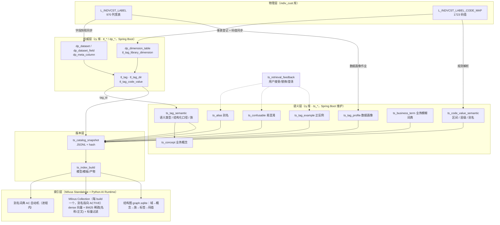

# 标签语义层与检索索引建设方案

> 所属：标签智能体 · 模块 A「高精度标签语义引擎」的基础数据架构
> 范围：标签语义层（元数据、别名、口径、码值、版本）+ 检索索引（版本快照、词典、BM25、向量、Milvus 选型与索引构建治理）
> 不含：查询理解 Prompt、受限选择、DSL 校验、LangGraph 编排（另文）
> 日期：2026-09-16（同日修订：引入 Milvus Standalone，见 §7.7）　状态：方案（待评审）

---

## 0. 结论摘要

1. **在现有 `tl_*` 权威层之上新建 `ts_*` 语义层，不改宽 `tl_tag`。** `tl_tag` 继续负责标签身份、状态、审批、来源绑定；`ts_*` 负责检索所需的一切语义（别名、结构化口径、语义类型、码值语义、易混淆、示例、业务词典），以 `tag_id` 为稳定连接键。这对应 OceanBase 方案里"本体层独立、Binding 层是唯一物理耦合点"的分层思想。
2. **语义模型引入"业务概念 → 标签族 → 标签"三级。** 对 969 个标签按名称做时间锚点/统计口径/来源限定词的规则分解，可归并为约 709 个标签族，其中 171 族有 2 个以上成员（覆盖 431 个标签，例：AUM 族 13 个仅时间锚点不同）。检索先命中族，再由确定性规则按时间锚点选成员或发起澄清——这是把"易混淆标签"从检索难题变成结构化问题的关键杠杆。
3. **快照即契约。** 每次发布生成不可变 `TagCatalogSnapshot`（JSONL + 内容哈希），Python 检索运行时只消费快照，所有索引产物（别名词典、BM25、Embedding 矩阵）绑定 `snapshot_id + 模型/模板版本`，Benchmark 与线上 Trace 均记录该三元组，保证可复现。权限不进快照，在查询时用 Spring Boot 返回的可见标签集过滤。
4. **码值是一等检索对象。** 1723 条码值（含 1270 条三级机构联行号）单独建文档并入索引；有序分档码值解析出数值上下界，使"行外资产超过 100 万"能落到 `OUTSIDE_ASSET_WAN_KYC in (03,04,…)`。
5. **检索索引落在 Milvus Standalone（≥ 2.5）。** 一个 Collection 同时承载稠密向量、两路 BM25 稀疏向量（名称/正文，`jieba` 分词）与标量元数据，标量过滤直接实现权限白名单与文档类型筛选；每个 `index_build` 对应一个 Collection，用 Collection 别名做 ACTIVE 原子切换与回滚。Milvus 是快照的可重建派生物，不是真相源；保留 numpy + rank_bm25 的本地实现作为降级与对照基线。可行性评估见 §7.7。
6. **建设流水线可执行且分阶段：** 码表入库与绑定 → 数据画像 → 规则分解建族 → LLM 批量富化草稿 → 人工复核 → 质量门禁 → 快照发布 → Milvus 索引构建与别名切换 → Gold 集回归。

---

## 1. 现状与输入盘点

### 1.1 原始数据（`sql/indiv_cust/`，已生成、未入库）

| 对象 | 事实 |
|---|---|
| `indiv_cust.L_INDVCST_LABEL` | 970 列（`CUST_ID` + 969 标签），一行一客户。列类型分布：TINYINT 129（布尔）、TEXT 155（选项/文本）、DECIMAL 449、INT 160、DATE 66、DATETIME 10。字段 COMMENT 即原始中文标签名。 |
| `indiv_cust.L_INDVCST_LABEL_CODE_MAP` | 结构与既有 `dim_customer_tag_code` 完全一致：`(tag_name_en, tag_code) PK, tag_name_cn, code_definition, code_sort, last_update_time`。覆盖 177 个选项/布尔字段、1723 条码值：布尔 129×2=258；选项 42 字段 195 条（其中大量标注 ★推定）；机构 6 字段 1270 条真实联行号（一级/二级/三级 × 开户/管户，天然树形）。 |
| 码值特征 | 布尔统一 `1=是/0=否`；分类用短字母码（M/F）；**有序分档用前导零数字码**（`01=50万以下, 02=50万(含)-100万 …`），区间语义只存在于 `code_definition` 文本中。 |

### 1.2 现有权威层（`ry` 库，taglibrary / databroker 模块）

| 表 | 与本方案的关系 |
|---|---|
| `tl_tag` | 库 107「个人客户经营标签库」970 标签已上线（status=2, version=3）。已有：`tag_name / field_name / tag_type(文本型/数值型/选项型/布尔型/日期型) / data_type / business_caliber(500) / tech_caliber(500) / update_cycle / status / version / source_snapshot(物理绑定 JSON)`。**缺**：别名、单位、允许操作符、时间窗口、易混淆、示例、权限范围、检索文本、快照。 |
| `tl_tag_dir` | 两级目录：9 章节 + 55 末级（客户概况/客群特征/客户价值/产品持有/业务往来/营销管理/渠道管理/风险管理/默认）。无 ancestors 列，路径需递归。 |
| `tl_tag_code_value` | 按 `(library_id, field_name, code)` 存码值，source=SYNC/MANUAL。码值语义（区间、层级）无处存放。 |
| `tl_tag_library_dimension` → `dp_dimension_table` | 库级"默认码表"绑定机制已存在，目前仅绑定测试用 `dim_customer_tag_code`。 |
| `tl_tag_metadata_change` / `tl_audit_log` | 五字段元数据变更需走草稿→提交→审批。**语义层字段不宜塞入此流程**（会让别名维护也要审批），需要独立、轻量的复核机制。 |
| `dp_dataset_field` / `dp_meta_column` | 物理列真相；`tl_tag.source_snapshot` 已完成 Binding。 |

### 1.3 已定的技术决策（来自启动清单与课题材料）

- AI Runtime：Python 3.11+ / FastAPI / LangGraph，独立部署，通过 Spring Boot API 集成，权限与客群创建归原系统。
- 检索栈：多路召回（精确/别名/BM25/Embedding/规则/历史纠错）→ RRF → 可替换 Reranker → 候选内受限选择。
- 向量存储：启动清单原建议"MVP 不上向量数据库"。**本方案修订为引入 Milvus Standalone**（评估见 §7.7）：规模上确实用不到，但 Milvus 把稠密/稀疏（BM25）/标量过滤/多版本别名切换收敛到一个组件，替代了自研 BM25 + 内存矩阵 + 权限过滤 + 产物管理四件事，且 Java/Python SDK 齐备。本地 numpy/rank_bm25 实现降级为对照基线。Embedding / Reranker 模型在同一 Benchmark 上 A/B 决定。
- 竞赛承诺：Recall@20、Auto Precision、Coverage、Query Exact Match 同时公布；幻觉标签、越权/未发布标签引用率为 0。

### 1.4 从三份参考文档提炼的硬约束

| 来源 | 约束 |
|---|---|
| 两大亮点方案 §3.2 | 标签知识质量是第一道防线；检索文本必须是"上下文化标签文档"而非标签名；置信度由可观测特征校准。 |
| NL2Tag 详解 §16 | 硬路由会截断正确字段 → 主题域只做软先验；向量结果必须门控；序语义不能共用 Top 40% 启发式 → 需字段级有序码值配置；数学边界词（以上/至少）需口径、解析、Benchmark 三处一致。 |
| OceanBase 语义网络 §5/§9/§10 | 语义层独立于物理层，Binding 用稳定 ID；图结构 + 字面索引 + 向量索引三种存储并存；大规模时"概览 → 业务域收敛 → 域内搜索"分级召回；Gold 集固定、按规模梯度加 hard negative 验证召回稳定性。 |

---

## 2. 设计目标与原则

### 2.1 目标

| 维度 | 目标 |
|---|---|
| 覆盖 | 969 标签 100% 具备：语义类型、结构化口径、≥3 条别名、允许操作符、检索文档；177 码值字段 100% 具备码值语义（布尔/分类/有序区间/层级）。 |
| 可复现 | 任一 Trace / 评测结果能回到 `(snapshot_id, index_build_id, doc_template_version)`。 |
| 召回 | 候选 Recall@20 ≥ 99.5%（Gold 集），标签族级 Recall@10 ≥ 99%。 |
| 可扩展 | 同一模型支持 2828（脱敏版全量）→ 3396（行内实际）标签、多标签库（信用卡/远程银行）、多对象（客户/卡片/员工）。 |
| 可运营 | 别名、词典、易混淆说明的日常维护不需要发版、不需要走五字段审批流。 |

### 2.2 原则

1. **权威与语义分离**：`tl_tag` 是"这个标签是谁、能不能用"；`ts_*` 是"这个标签怎么被理解"。前者变更走审批，后者走轻量复核。
2. **结构优先于文本**：能结构化的口径（时间锚点、统计方式、单位、范围）一律结构化存储，文本口径作为补充；结构字段既是检索特征也是校验依据。
3. **一切语义有出处**：每条别名/口径/易混淆说明都带 `source(RULE/LLM/HUMAN/FEEDBACK/SYNC)` 与 `review_status`，未复核的 LLM 生成内容可进入索引但权重降级、不可作为"精确命中"通道。
4. **快照不含权限**：快照是用户无关的；权限在查询时以白名单过滤，避免快照按角色爆炸。
5. **索引是快照的派生物**：索引可随时由快照 + 模板 + 模型重建，不允许手工修补索引。

---

## 3. 总体架构



分层职责：

| 层 | 存储 | 维护方 | 变更频率 |
|---|---|---|---|
| 物理层 | `indiv_cust` | 数据加工 | 日批 |
| 权威层 | `ry.tl_*/dp_*` | 现有标签库审批流 | 低 |
| 语义层 | `ry.ts_*` | 标签管理员 + LLM 批量草稿 + 反馈回流 | 高（日常运营） |
| 版本层 | `ry.ts_catalog_snapshot / ts_index_build` + 对象存储/文件 | 发布动作 | 每次发布 |
| 索引层 | Milvus Standalone（向量/BM25/标量）+ Python 进程内词典与结构图 + 本地产物目录 | 构建脚本 | 跟随快照 |

---

## 4. 标签语义模型

### 4.1 概念层级

```text
业务对象 Object        个人客户（tl_tag_library.tag_object）
  └─ 业务域 Domain      客户概况 / 客群特征 / 客户价值 / 产品持有 / 业务往来 / 营销管理 / 渠道管理 / 风险管理
       └─ 业务概念 Concept   AUM、理财持有、异名跨行转入、客户等级、理财风评等级 …
            └─ 标签族 Family    概念 + 统计方式 + 范围限定（AUM·时点余额·全渠道；AUM·时点余额·本行）
                 └─ 标签 Tag       族 + 时间锚点（当前时点AUM、T-3月末AUM、近12个月最高AUM …）
                      └─ 码值 CodeValue（选项/布尔标签）
```

- **Domain** 直接复用 `tl_tag_dir` 一级目录，不新建表；`ts_concept.domain_dir_id` 指向它。
- **Concept** 是新增的语义节点：承载业务口语别名的主战场（"入金/资金流入/转入"挂在概念上，而非 17 个转入标签各挂一遍）。
- **Family** 用 `ts_tag_semantic.family_key`（规范化字符串）表示，不单独建表；族成员由 `family_key` 分组即得。
- 规则分解得到的初始估计：969 标签 → 约 709 族 / 预计 250~350 概念（概念数以 Step 3 人工归并结果为准）。

### 4.2 语义类型体系（`semantic_type`）

`tl_tag.tag_type` 五类太粗，无法决定操作符、单位换算和码值处理方式。语义层细化为：

| semantic_type | 判定依据（来自宽表类型 + 码表 + 名称） | 允许操作符 | 说明 |
|---|---|---|---|
| `BOOL` | TINYINT 且码表为 1/0 | `=` | 名称含"标志/是否" |
| `ENUM_NOMINAL` | TEXT + 码表，码值无序 | `= in not_in` | 性别、证件类型、状态 |
| `ENUM_ORDINAL` | TEXT + 码表，码值有序（分档/等级） | `= in >= <= between(按序)` | 行外资产分档、客户等级、风评 C1-C5；需 `ts_code_value_semantic.rank/lower/upper` |
| `ENUM_HIERARCHY` | 机构类 6 字段 | `= in under(子树)` | 联行号树，支持"宁波分行下所有支行" |
| `TEXT_FREE` | TEXT 无码表 | `like contains` | 手机型号、产品名称 |
| `NUM_AMOUNT` | DECIMAL，名称含金额/余额/AUM/中收/收益 | `> >= < <= between` | 单位默认元；名称含"(万元)"时 unit=万元 |
| `NUM_COUNT` | INT，名称含次数/笔数/天数/数量 | 同上 | 整数 |
| `NUM_RATIO` | DECIMAL，名称含占比/比例/率/完整度 | 同上 | 需明确量纲 0-1 或 0-100（由数据画像确认） |
| `NUM_SCORE` | 名称含分/评分/意向分 | 同上 | 模型分，需给分布分位 |
| `DATE` | DATE/DATETIME | `= > < between relative(近N天)` | 日期型可派生"距今天数" |
| `ID_KEY` | `is_object_key=1` | 不参与检索 | 客户号 |

### 4.3 结构化口径（`caliber_struct` JSON）

把标签名与文本口径中可机读的部分提取为字段，供检索特征、族解析和 DSL 校验共用：

```json
{
  "time_anchor_type": "MONTH_OFFSET",       // POINT(当前/最新) | WINDOW(近N天/近N月) | MONTH_OFFSET(T-N月末/上月末) | YTD(本年) | MTD(本月) | HIST(历史) | FUTURE(未来N天) | NONE
  "time_anchor_label": "T-3月末",
  "time_offset_months": 3,
  "time_window_days": null,
  "statistic": "EOP",                       // EOP期末 | AVG_DAILY日均 | MAX | MIN | SUM累计 | COUNT | FLAG | RATIO | LATEST | SCORE
  "scope": "ALL",                           // ALL | OUR_BANK(本行) | PB(私银) | ...
  "source_system": null,                    // WECOM(企微标签) | PB_KYC | OPS_KYC | RISK_EVAL(理财风评) | MODEL(模型/规则预测) | CREDIT_REPORT
  "unit": "CNY", "unit_scale": 1,           // 元=1, 万元=10000, %=100, 0-1 比例=1
  "numerator": null, "denominator": null,   // 占比类填写
  "boundary_semantics": "inclusive_lower"   // 有序分档区间的边界约定
}
```

时间锚点词典（初版，来自 969 标签名的实际分布）：`当前(306) 历史(163) 本年(100) 本月(79) 上月(52) 上月末(50) 近7天(31) 近30天(17) 上12个月(12) 上年(12) 最新(11) 近6个月(9) 上6个月(9) 近12个月(8) 上年末(4) 近3个月(4) 未来7天(3) 上3个月(3) 近15天(3) 历史最高(2) T-N月末(13)`。该词典既用于建族，也用于查询侧解析"近 30 天""上个月末"。

### 4.4 别名体系（`ts_alias`）

| 挂载对象 target_type | 例 | 作用 |
|---|---|---|
| `CONCEPT` | 入金 / 资金转入 / 资金流入 / 跨行转入 → 概念「异名跨行转入」 | 一处维护，族内所有标签受益 |
| `TAG` | "当前有理财" → 当前持有理财标志 | 特定标签的固定口语 |
| `CODE_VALUE` | 女 / 女性 / 女士 → GENDER=F；私行 / 私人银行 → 客户等级码 | 值级直查（NL2Tag 的 enum_match 通道） |
| `DOMAIN` | 买了什么 → 产品持有 | 软路由先验 |

`alias_type`：`FORMAL`（正式别名）/ `COLLOQUIAL`（口语）/ `ABBR`（缩写，如 AUM、KYC、PB）/ `HISTORICAL`（历史名称）/ `NEGATIVE`（明确**不**应命中，用于抑制，如"理财年限"≠"理财持有"）。`weight` 参与融合打分；`review_status` 未通过的别名只进 BM25/向量文档，不进精确命中词典。

### 4.5 码值语义（`ts_code_value_semantic`）

对 `tl_tag_code_value` 的 1:1 扩展：

- 有序分档：`rank`, `lower_bound`, `upper_bound`, `bound_unit`, `lower_inclusive`, `upper_inclusive`。由规则从 `code_definition` 解析（`50万(含)-100万` → `[500000, 1000000)`），解析失败标 `needs_review`。
- 层级：`parent_code`, `level`, `path`。机构类字段：一级机构 → 二级 → 三级，用联行号前缀与名称归属关系建树（Step 2 脚本产出，人工抽检）。
- 别名：走 `ts_alias(target_type=CODE_VALUE)`。
- `is_unknown_bucket`：标记"其他/未知/未填写"类码值，检索时降权、不作为正向推荐。

### 4.6 易混淆（`ts_confusable`）与正反例（`ts_tag_example`）

- 易混淆对来源三类：(a) 同族不同时间锚点——自动生成，`difference_note` 由模板填充（"两者仅统计时点不同：当前 vs 上月末"）；(b) 同概念不同来源——如三种 KYC 行外资产；(c) 名称相似不同概念——需人工，例：理财年限（企微）vs 历史持有理财标志。
- `disambiguation_hint` 记录"用户说了什么词应选哪一个"，直接注入受限选择 Prompt 的候选对比区。
- 正反例：`utterance + expected_condition JSON`，正例用于 few-shot 与 BM25 文档增强，反例（NEG）用于评测 hard negative 与 `NEGATIVE` 别名。

### 4.7 业务模糊词典（`ts_business_term`）

| term_type | 例 | options | default_policy |
|---|---|---|---|
| `FUZZY_TIME` | 最近 / 近期 | 7天 / 30天 / 90天 | `ASK`（澄清） |
| `FUZZY_QUANTITY` | 大额 | 20万 / 50万 / 100万 | `ASK` |
| `FUZZY_CATEGORY` | 理财 | 仅理财产品 / 含基金 / 含保险 | `ASK` |
| `ORDINAL_WORD` | 中等及以上 / 高 | 按目标字段 rank 映射（C3+ / 前 40%） | `RESOLVE_BY_FIELD`（用字段级 rank，不用通用比例） |
| `NEGATION` | 未 / 没有 / 不 / 排除 / 非 | — | 取反 |
| `BOUNDARY` | 以上 / 至少 / 超过 / 以下 / 不到 | `>=` / `>=` / `>` / `<=` / `<` | 固定映射，Benchmark 同口径 |

---

## 5. 数据库设计（`ry` 库，前缀 `ts_`）

迁移文件：`sql/migration/V20260916_01__tag_semantic_layer.sql`（幂等、只向前）。下列为字段精要，审计五列（create_by/create_time/update_by/update_time/remark）省略。

### 5.1 `ts_concept` 业务概念

```sql
concept_id      bigint PK AI
concept_code    varchar(64)  NOT NULL UNIQUE    -- 如 FUND_INFLOW_INTERBANK
concept_name    varchar(64)  NOT NULL           -- 异名跨行转入
domain_dir_id   bigint       NOT NULL           -- tl_tag_dir 一级目录
tag_object      varchar(16)  NOT NULL           -- 个人客户 / 信用卡客户 / ...
definition      varchar(1000)
parent_id       bigint DEFAULT 0                -- 概念可分层（资金流动 > 跨行转入）
status          char(1) '0'                     -- 0 启用 1 停用
source          varchar(16)                     -- RULE/LLM/HUMAN
review_status   varchar(16) 'DRAFT'             -- DRAFT/REVIEWED
```

### 5.2 `ts_tag_semantic` 标签语义（与 `tl_tag` 1:1）

```sql
tag_id              bigint PK                   -- = tl_tag.tag_id
concept_id          bigint
family_key          varchar(128) NOT NULL       -- concept_code|statistic|scope|source_system
semantic_type       varchar(24)  NOT NULL       -- §4.2
allowed_operators   varchar(128) NOT NULL       -- JSON 数组
default_operator    varchar(16)
unit                varchar(16)                 -- CNY/WAN_CNY/PERCENT/RATIO/COUNT/DAY/NONE
unit_scale          decimal(18,4) DEFAULT 1
caliber_struct      json         NOT NULL       -- §4.3
definition_long     varchar(2000)               -- 面向检索的完整业务定义（可由 LLM 起草）
sensitivity         varchar(16) 'INTERNAL'      -- 继承 dp_dataset_field.sensitivity_level
completeness_score  tinyint                     -- 0-100，§9.1
source              varchar(16)
review_status       varchar(16) 'DRAFT'
semantic_version    int DEFAULT 1               -- 语义层自身版本，独立于 tl_tag.version
KEY (concept_id), KEY (family_key), KEY (review_status)
```

### 5.3 `ts_alias` 别名

```sql
alias_id        bigint PK AI
target_type     varchar(16) NOT NULL            -- TAG/CONCEPT/CODE_VALUE/DOMAIN
target_id       varchar(96) NOT NULL            -- TAG:tag_id | CONCEPT:concept_id | CODE_VALUE:tag_id#code | DOMAIN:dir_id
alias_text      varchar(64) NOT NULL
alias_norm      varchar(64) NOT NULL            -- 归一化（去空格、全半角、小写）
alias_type      varchar(16) NOT NULL            -- FORMAL/COLLOQUIAL/ABBR/HISTORICAL/NEGATIVE
weight          decimal(4,2) DEFAULT 1.00
source          varchar(16) NOT NULL            -- RULE/LLM/HUMAN/FEEDBACK
review_status   varchar(16) 'DRAFT'
hit_count       int DEFAULT 0                   -- 线上命中次数（飞轮）
UNIQUE (target_type, target_id, alias_norm), KEY (alias_norm)
```

### 5.4 `ts_code_value_semantic` 码值语义

```sql
tag_id           bigint NOT NULL
code             varchar(64) NOT NULL
rank_no          int                             -- 有序分档序号
lower_bound      decimal(20,4)
upper_bound      decimal(20,4)
lower_inclusive  tinyint(1)
upper_inclusive  tinyint(1)
bound_unit       varchar(16)
parent_code      varchar(64)                     -- 层级
level_no         tinyint
is_unknown_bucket tinyint(1) DEFAULT 0
source           varchar(16)
review_status    varchar(16) 'DRAFT'
PRIMARY KEY (tag_id, code)
```

### 5.5 `ts_confusable` / `ts_tag_example` / `ts_business_term` / `ts_tag_profile`

```sql
-- ts_confusable
pair_id PK AI; tag_id_a bigint; tag_id_b bigint; confusion_type varchar(16) -- TIME_FACET/SOURCE/SIMILAR_NAME/SCOPE
difference_note varchar(500); disambiguation_hint varchar(500); source; review_status
UNIQUE (tag_id_a, tag_id_b)

-- ts_tag_example
example_id PK AI; tag_id bigint; example_type char(3) -- POS/NEG
utterance varchar(200); expected_condition json; source; review_status
KEY (tag_id)

-- ts_business_term
term_id PK AI; term varchar(32) NOT NULL; term_norm varchar(32); term_type varchar(16) -- §4.7
options json; default_policy varchar(16); applicable_semantic_types varchar(128); tag_object varchar(16)
review_status; UNIQUE (term_norm, term_type, tag_object)

-- ts_tag_profile（日批覆盖或按 profile_date 保留）
tag_id bigint; profile_date date; row_count bigint; null_rate decimal(6,4); distinct_count int
min_val decimal(20,4); max_val decimal(20,4); p50 decimal(20,4); p90 decimal(20,4); p99 decimal(20,4)
top_values json                                   -- 前 20 个值及占比（选项/文本型）
PRIMARY KEY (tag_id, profile_date)
```

### 5.6 `ts_catalog_snapshot` / `ts_index_build` / `ts_retrieval_feedback`

```sql
-- ts_catalog_snapshot
snapshot_id      varchar(40) PK                 -- L107-20260916-001
library_id       bigint NOT NULL
snapshot_no      int NOT NULL
tag_count        int; concept_count int; alias_count int; code_value_count int
content_hash     char(64) NOT NULL              -- sha256(JSONL 规范化内容)
storage_uri      varchar(500) NOT NULL          -- file:///data/tag-snapshots/L107-20260916-001.jsonl 或对象存储
schema_version   varchar(8) 'v1'
status           varchar(16) 'PUBLISHED'        -- DRAFT/PUBLISHED/ACTIVE/RETIRED（每库仅一个 ACTIVE）
quality_report   json                           -- 门禁结果 §9.2
publish_by; publish_time
UNIQUE (library_id, snapshot_no)

-- ts_index_build
build_id         varchar(48) PK                 -- L107-20260916-001#bge-m3#tpl1
snapshot_id      varchar(40) NOT NULL
doc_template_version varchar(16) NOT NULL       -- 检索文档模板版本
analyzer_version varchar(32)                    -- Milvus analyzer 参数哈希（jieba + 自定义词典）
embedding_model  varchar(64); embedding_dim int; embedding_model_hash varchar(64)
reranker_model   varchar(64)
store_type       varchar(16) NOT NULL           -- MILVUS / LOCAL
milvus_collection varchar(96)                   -- tag_docs_l107_20260916_001_bgem3_tpl1
milvus_alias     varchar(64)                    -- 切为 ACTIVE 后填写：tag_docs_active_l107
artifact_uri     varchar(500) NOT NULL; artifact_hash char(64)   -- 本地产物目录（词典/结构图/manifest）
doc_count        int; doc_id_hash char(64)      -- 全部 doc_id 排序后哈希，用于校验 Milvus 行集与快照一致
status           varchar(16)                    -- BUILDING/READY/ACTIVE/FAILED/RETIRED
eval_summary     json                           -- Gold 集 Recall@10/20、族级 Recall
build_time; build_duration_ms

-- ts_retrieval_feedback（飞轮入口，AI Runtime 经 Spring Boot API 写入）
feedback_id PK AI; trace_id varchar(64); snapshot_id; build_id; user_id bigint
query_text varchar(500); requirement_text varchar(200)        -- 原子条件片段
recommended_tag_id bigint; final_tag_id bigint
action varchar(16)                                            -- ACCEPT/REPLACE/REMOVE/CLARIFY_PICKED/REJECT_ALL
clarify_question varchar(300); clarify_answer varchar(100)
confidence decimal(4,3); rank_features json
create_time
KEY (snapshot_id), KEY (final_tag_id), KEY (action)
```

### 5.7 对既有表的最小改动

- `tl_tag_dir` 增加 `ancestors varchar(200)`（与 `dp_*_catalog` 一致），避免快照导出时递归；迁移脚本回填。
- 其余 `tl_*` 不动。码值继续以 `tl_tag_code_value` 为权威，`ts_code_value_semantic` 只增补语义。

---

## 6. 版本与快照

### 6.1 `TagCatalogSnapshot v1`（JSONL，Java 导出 → Python 消费）

每行一个记录，`kind` 区分类型；文件头一行 `meta`：

```jsonl
{"kind":"meta","snapshot_id":"L107-20260916-001","library_id":107,"tag_object":"个人客户","schema_version":"v1","generated_at":"2026-09-16T10:00:00+08:00","counts":{"tag":969,"concept":312,"alias":6120,"code_value":1723}}
{"kind":"domain","dir_id":9001,"name":"业务往来","path":["业务往来"],"aliases":["交易","往来","资金"]}
{"kind":"concept","concept_id":211,"code":"FUND_INFLOW_INTERBANK","name":"异名跨行转入","domain_dir_id":9001,"definition":"...","aliases":[{"text":"入金","type":"COLLOQUIAL","w":1.0,"reviewed":true}]}
{"kind":"tag","tag_id":5123,"field_name":"INTERBANK_INFLOW_30D_FLAG","name":"近30天异名跨行转入标志","status":"2","version":3,"dir_path":["业务往来","资金流动"],"concept_id":211,"family_key":"FUND_INFLOW_INTERBANK|FLAG|ALL|","semantic_type":"BOOL","tag_type":"布尔型","data_type":"TINYINT","allowed_operators":["="],"unit":"NONE","caliber_struct":{...},"business_caliber":"...","tech_caliber":"...","definition_long":"...","aliases":[...],"confusable":[{"tag_id":5122,"type":"TIME_FACET","note":"仅统计窗口不同：近7天"}],"examples":[{"type":"POS","utterance":"最近一个月有跨行转入的客户"}],"code_values":[{"code":"1","label":"是"},{"code":"0","label":"否"}],"profile":{"null_rate":0.02,"distinct_count":2},"sensitivity":"INTERNAL","completeness_score":92,"binding":{"table":"L_INDVCST_LABEL","column":"INTERBANK_INFLOW_30D_FLAG"}}
{"kind":"code_value","tag_id":5001,"code":"03","label":"100万(含)-300万","rank":3,"lower":1000000,"upper":3000000,"aliases":["一百万到三百万"]}
{"kind":"term","term":"大额","type":"FUZZY_QUANTITY","options":[...],"policy":"ASK"}
```

规则：

- 只导出 `tl_tag.status='2'`（已上线）且 `del_flag='0'` 的标签；未上线标签**不进快照**，从源头保证"未发布标签引用率 0"。
- `content_hash` 对去掉 `generated_at` 后的规范化 JSONL 计算；内容不变则不生成新快照。
- 未复核（`review_status=DRAFT`）的别名/口径导出时带 `reviewed:false`，索引侧决定用途。
- 权限不在快照中；查询时由 `GET /taglibrary/semantic/eligible-tags` 提供当前用户可见 `tag_id` 集合做过滤（召回前过滤 + DSL 校验复核，两道）。

### 6.2 状态机与触发

```text
语义层编辑（随时） ──发布──▶ DRAFT ──质量门禁通过──▶ PUBLISHED ──索引 READY 且评测达标──▶ ACTIVE
                                        │不通过                                   │新快照 ACTIVE
                                        ▼                                         ▼
                                     退回编辑                                   RETIRED（保留供回放）
```

触发发布的事件：标签上下线审批通过、批量语义复核完成、词典调整；日常别名微调可累积后按日发布。

### 6.3 索引产物布局

向量与 BM25 索引存于 Milvus（§7.7），本地目录只保留 Milvus 不承担的部分：

```text
/data/tag-index/
  L107-20260916-001/                       # snapshot_id
    snapshot.jsonl                         # 原样拷贝，校验 content_hash
    graph.sqlite                           # 域/概念/族/标签/码值/易混淆 结构图（供 overview/subgraph 工具与族解析）
    bge-m3#tpl1/                           # build（模型 # 模板）
      alias_automaton.pkl                  # 精确/别名词典（AC 自动机），仅 reviewed 别名
      docs.jsonl                           # 渲染后的三类文档（写入 Milvus 的原始行，可重放）
      manifest.json                        # build_id、模型 hash、analyzer 参数、milvus_collection、doc_id_hash、eval_summary
      local_fallback/  emb.npy bm25.pkl    # 可选：LOCAL store 的对照/降级产物

Milvus:
  collection  tag_docs_l107_20260916_001_bgem3_tpl1   # 每个 build 一个 Collection，不可变
  alias       tag_docs_active_l107                    # 指向当前 ACTIVE build；切换/回滚只改别名
```

---

## 7. 检索索引设计

### 7.1 三类检索文档

| 文档类型 | 数量级 | 用途 |
|---|---|---|
| `tag` 上下文化标签文档 | 969 | 主召回对象 |
| `concept` 概念文档 | ~300 | 族级召回；概念命中后展开族成员，抗时间锚点干扰 |
| `code_value` 码值文档 | 1723（机构类 1270 单独分区） | 值级直查："女性""私银""宁波分行"直接定位 `tag_id + code` |

标签文档模板（`doc_template_version=tpl1`，字段有序拼接，便于 BM25 字段加权）：

```text
[名称] 近30天异名跨行转入标志
[别名] 近一个月跨行转入 | 30天内有他行转入 | 入金标志
[目录] 业务往来 > 资金流动
[概念] 异名跨行转入：他行账户向本行账户的非同名转入
[口径] 时间：近30天滚动窗口；统计：是否发生（标志）；范围：全渠道
[类型] 布尔型；取值：1=是，0=否
[定义] 统计日前30个自然日内，客户名下账户是否发生过来自他行非同名账户的转入交易……
[示例] 最近一个月有跨行转入的客户 | 近30天有他行资金进来
[区别于] 近7天异名跨行转入标志（窗口 7 天）；当前异名跨行转入金额（金额而非标志）
```

Embedding 输入使用去掉 `[示例]/[区别于]` 的精简版（避免反例词污染向量），BM25 使用全文；两者由同一模板函数派生，模板变更即 `doc_template_version` 变更。

### 7.2 召回通道

| 通道 | 实现 | 输入 | 输出粒度 | 说明 |
|---|---|---|---|---|
| ① 精确/别名 | AC 自动机（`alias_automaton.pkl`，进程内），长词优先，单字需上下文 | 原子条件文本 | TAG/CONCEPT/CODE_VALUE | 只含 reviewed 别名；命中即高置信特征 |
| ② BM25-名称 | Milvus BM25 Function：`name_text`（名称+别名）→ `sparse_name`，`jieba` 分词 + 自定义词典 | 归一化查询（去否定词、去数字单位） | 三类文档各取 Top 30（`filter="doc_type=='tag'"` 等分三次查） | 名称字段独立建稀疏向量，等价于 BM25F 的高权重字段 |
| ③ BM25-正文 | Milvus BM25 Function：`body_text`（§7.1 全文）→ `sparse_body` | 同上 | 同上 | 定义/口径/示例/码值的关键词匹配 |
| ④ Dense | Milvus `dense` 字段，COSINE；模型 BGE-M3（候选，A/B：bge-large-zh-v1.5 / Qwen3-Embedding），查询侧由 Python 编码 | 原子条件文本 | 三类文档各 Top 30 | 索引类型 AUTOINDEX（≤ 1 万行时等价于 FLAT，精确检索） |
| ⑤ 结构规则 | 时间锚点/统计词/单位/否定/边界词解析；域软先验 | 原子条件 | 特征与约束，不产候选 | 用于族成员解析与打分，不做硬过滤 |
| ⑥ 历史纠错 | `ts_retrieval_feedback` 聚合：`(requirement_norm → final_tag_id)` 接受率 ≥ 0.9 且 n ≥ 5 | 归一化片段 | TAG | 定期物化进快照 `term`/`alias(source=FEEDBACK)` |

②③④ 均在 Milvus 中执行，且**在检索时带 `tag_id in [eligible…]` 标量过滤**，越权标签从召回阶段即不可见（DSL 校验阶段再复核一次）。

### 7.3 融合与排序

```text
①(进程内) + ②③④(Milvus 三类文档 × 三路 = 9 次 search，或 hybrid_search 合并) ──RRF(k=60)──▶ 候选 Top 50（tag 级；concept/code 命中展开为其 tag 或 tag+code）
  ──族聚合──▶ 按 family_key 归组，组内按 ⑤ 的时间锚点匹配度排序
  ──Reranker（bge-reranker-v2-m3，Python 进程内，候选 50 → 打分）──▶ Top 10
  ──权限复核（eligible tag set）──▶ 候选集（交给受限选择）
```

两种 Milvus 调用方式：

- **分路 `search`（默认）**：②③④ 各自独立调用，拿到每路排名后在 Python 侧与①⑥统一 RRF。多 3~6 次毫秒级 RPC，换来 §7.4 的每通道排名特征（置信度校准必需）。
- **`hybrid_search` + `RRFRanker`（快速路径）**：一次调用融合 sparse_name/sparse_body/dense，用于对话中的实时预估、联想等对特征无要求的场景。两者共用同一 Collection，不重复建索引。

Reranker 留在 Python 进程内而不用 Milvus 2.6 的模型重排 Function：需要对候选注入族信息与易混淆说明后再打分，且便于 A/B 换模型。

族解析规则（确定性，发生在 LLM 之前）：

| 查询时间表达 | 族内选择 |
|---|---|
| 明确且族内存在（"近 30 天"，族有 30D 成员） | 直接选中，其余成员标为 `confusable_shown` |
| 明确但族内不存在（"近 60 天"，族只有 7D/30D） | 进入澄清：列出族内可选时间锚点 |
| 无时间表达，族只有 1 个成员 | 选中 |
| 无时间表达，族有多成员 | 若存在 `当前/POINT` 成员则默认 POINT 并**在结果中显式标注默认口径**；否则澄清 |

### 7.4 可观测排序特征（供置信度校准）

每个候选输出：`exact_hit(0/1)`, `alias_hit_type`, `bm25_name_rank`, `bm25_body_rank`, `dense_rank`, `rrf_score`, `rerank_score`, `margin_to_2nd`, `channel_agreement(命中通道数)`, `family_resolved(0/1)`, `time_facet_conflict(0/1)`, `completeness_score`, `unresolved_fuzzy_terms`, `history_accept_rate`。这些字段随 Trace 落入 `ts_retrieval_feedback.rank_features`，用于训练/校准分流阈值。

### 7.5 分级召回（面向 2828/3396 规模）

沿用 OceanBase"概览 → 域收敛 → 域内搜索"：

1. `catalog_overview()`：返回 8 个业务域及概念数、标签数（来自 `graph.sqlite`），作为 LLM 意图拆解的上下文（≈ 1 KB，可放进 Prompt）。
2. 域软先验：⑤ 通道给出域概率，作为 RRF 后 ±10% 的加权，不过滤。
3. 969 规模下全量检索；≥ 2000 时仍全量（Milvus 上万行仍为毫秒级），仅在 Reranker 前用域先验截断到 Top 80。多标签库（信用卡、远程银行）上线后，`filter="library_id==107"` 或按库分 Collection 均可，优先前者。

### 7.6 Python 侧模块结构（`ai-runtime/tag_semantic/`）

```text
tag_semantic/
  snapshot/loader.py        # 读取 JSONL、校验 hash、构建内存对象与 graph.sqlite
  docs/templates.py         # tpl1 文档模板（唯一实现，name_text / body_text / dense_text 三种视图）
  index/store.py            # IndexStore 抽象：build(docs) / search(channel, query, filter, k) / activate(build_id) / drop(build_id)
  index/milvus_store.py     # 默认实现：Collection 建模、BM25 Function、批量写入、别名切换
  index/local_store.py      # 对照/降级实现：numpy + rank_bm25
  index/alias_index.py      # AC 自动机（进程内，两种 store 共用）
  index/embedder.py         # 模型加载、批量编码；记录模型 hash
  index/builder.py          # build(snapshot_id, model, tpl, store) → manifest.json + ts_index_build 回写
  retrieve/channels.py      # 六通道
  retrieve/fusion.py        # RRF、族聚合、reranker
  retrieve/facets.py        # 时间锚点/单位/否定/边界解析（与 ts_business_term 同源）
  retrieve/service.py       # retrieve(requirement, eligible_tag_ids, library_id) → candidates + features
  eval/gold.py  eval/run.py # §10
  cli.py                    # build / activate / eval / query
```

### 7.7 向量数据库选型：Milvus 可行性评估

#### 7.7.1 需求对照

| 本方案需要的能力 | Milvus 对应能力 | 结论 |
|---|---|---|
| 稠密向量检索（BGE-M3 1024 维，≤ 1 万行） | `FLOAT_VECTOR` + AUTOINDEX/HNSW，COSINE | 满足；规模远低于 Milvus 设计目标，精度等价于精确检索 |
| BM25 关键词检索，中文分词，可加行内术语词典 | Milvus ≥ 2.5 内置 `Function(type=BM25)`：`VARCHAR(enable_analyzer)` → `SPARSE_FLOAT_VECTOR`，`SPARSE_INVERTED_INDEX(metric=BM25)`；内置 `chinese` 分析器 = `jieba` tokenizer + `cnalphanumonly` filter | 满足；**自定义词典注入方式需 W1 验证**（jieba tokenizer 的自定义词参数），验证不通过则名称通道改为查询侧预分词 + `WHITESPACE`/自定义 tokenizer |
| 字段级权重（名称 > 别名 > 正文） | 无 BM25F；用两个文本字段各自建 BM25 稀疏向量，融合时加权或走两路 RRF | 满足（见 §7.2 ②③） |
| 多路融合 | `hybrid_search` + `RRFRanker` / `WeightedRanker`，一次请求多向量字段 | 满足；同时保留分路 `search` 以获取每通道排名特征 |
| 权限白名单过滤、文档类型/域筛选 | 标量字段 + `filter` 表达式（`tag_id in [...]`、`doc_type == 'tag'`），标量索引 | 满足；in-list 长度约 1000~3000 需 W1 压测（预期毫秒级） |
| 不可变版本 + 原子切换 + 回滚 | 每 build 一个 Collection；Collection **Alias** 指向 ACTIVE，`alter_alias` 原子切换 | 满足，且比自研产物目录切换更干净 |
| 可重建、可校验 | Collection 由 `docs.jsonl` 全量重建；`doc_id_hash` 与 `query(count)` 对账 | 满足 |
| Java 侧运维/展示（快照与索引页） | `milvus-sdk-java` v2 提供 `describeCollection / getCollectionStats / listAliases` | 满足；Spring Boot 只读访问，不写入 |
| 本机开发 | Milvus Lite（pip 内嵌） | **不满足**：Lite 不支持全文检索（BM25 Function）、`hybrid_search`、分区与别名 → 开发也必须 Standalone（Docker） |

#### 7.7.2 部署与资源

- **模式**：Milvus Standalone（`milvus-standalone` + `etcd` + `minio` 三容器，官方 docker compose），版本锁定 2.5.x 最新稳定版（全文检索自 2.5 起支持；2.6 的模型重排 Function 本方案不依赖）。仓库新增 `docker/milvus/docker-compose.yml` 并接入 `dev.sh`。
- **资源**：数据量 < 1 万行 × 1024 维，内存占用以进程基线为主；预留 4 vCPU / 8 GB，磁盘 20 GB 足够。与 tagpilot-prod 现有 MySQL/Redis 同机部署可行。
- **安全**：仅内网访问；启用 Milvus 鉴权并修改 root 口令；存储内容仅为标签元数据与聚合画像，**不含任何客户明细**；Collection 命名带 `library_id`，为多库权限隔离预留。
- **运维**：Standalone 的 etcd/minio 需纳入备份与监控；由于 Milvus 是派生物，灾备策略为"从 `ts_index_build` + `docs.jsonl` 重建"，不做 Milvus 级备份。
- **SDK**：Python `pymilvus`（AI Runtime 主客户端）；Java `milvus-sdk-java`（Spring Boot 只读运维）。

#### 7.7.3 Collection 建模

```python
schema.add_field("doc_id",        VARCHAR(96),  is_primary=True)     # tag:5123 | concept:211 | code:5001#03
schema.add_field("doc_type",      VARCHAR(16))                        # tag / concept / code_value
schema.add_field("library_id",    INT64)
schema.add_field("tag_id",        INT64)                              # concept 文档为 -1
schema.add_field("concept_id",    INT64)
schema.add_field("family_key",    VARCHAR(128))
schema.add_field("domain_dir_id", INT64)
schema.add_field("semantic_type", VARCHAR(24))
schema.add_field("code",          VARCHAR(64))                        # code_value 文档专用
schema.add_field("reviewed",      BOOL)                               # 文档主要内容是否经复核
schema.add_field("completeness",  INT16)
schema.add_field("name_text",     VARCHAR(1024), enable_analyzer=True, analyzer_params=CN_ANALYZER)
schema.add_field("body_text",     VARCHAR(8192), enable_analyzer=True, analyzer_params=CN_ANALYZER)
schema.add_field("sparse_name",   SPARSE_FLOAT_VECTOR)
schema.add_field("sparse_body",   SPARSE_FLOAT_VECTOR)
schema.add_field("dense",         FLOAT_VECTOR, dim=1024)
schema.add_function(Function("bm25_name", BM25, ["name_text"], ["sparse_name"]))
schema.add_function(Function("bm25_body", BM25, ["body_text"], ["sparse_body"]))
# 索引：dense AUTOINDEX/COSINE；sparse_* SPARSE_INVERTED_INDEX/BM25；tag_id、doc_type、domain_dir_id 标量索引
# CN_ANALYZER = {"tokenizer": "jieba", "filter": ["cnalphanumonly"]}  + 自定义词典（W1 验证）
```

不使用分区键（Partition Key）承载版本：版本粒度是"整份索引"，Collection + Alias 语义更直接，且避免旧版本行与新版本行在同一 Collection 内影响 BM25 的 IDF 统计。

#### 7.7.4 结论

| 维度 | 评估 |
|---|---|
| 功能可行性 | 高。所需能力在 Standalone 2.5+ 全部具备，仅"jieba 自定义词典"与"长 in-list 过滤性能"两项待 W1 验证，均有已知替代方案。 |
| 规模合理性 | 规模上属"杀鸡用牛刀"，但收益在**架构收敛**：BM25、向量、过滤、版本切换四件事由一个组件承担，Python 侧代码量减少，Java 侧可直接观测索引状态。 |
| 复杂度代价 | 新增 3 个容器与一个需要维护的中间件；开发环境不能用 Lite，必须 Docker。可接受。 |
| 可逆性 | 高。`IndexStore` 抽象 + `local_store.py` 对照实现保证随时可退回本地方案；Gold 集同时在两种 store 上回归，差异即为实现缺陷。 |
| 决策 | **采用 Milvus Standalone 作为默认 `IndexStore`**；`local_store` 保留为基线、CI 单测与故障降级路径。 |

---

## 8. 建设流水线（可执行步骤）

| 步骤 | 动作 | 产出 | 工具/位置 |
|---|---|---|---|
| **S0 码表入库与绑定** | 执行 `sql/indiv_cust/02~05`；将 `L_INDVCST_LABEL_CODE_MAP` 登记为 `dp_dimension_table`；绑定到库 107（`PUT /taglibrary/library/107/dimensions`）；执行批量映射同步把码值同步进 `tl_tag_code_value(source=SYNC)`；执行 `99_validate` | 1723 码值进入权威层 | 现有功能，无需开发 |
| **S1 迁移与骨架** | 新建 `ts_*` 表；`tl_tag_dir.ancestors` 回填；Java 域类/Mapper/Service 骨架 | `V20260916_01__tag_semantic_layer.sql` | taglibrary 模块 |
| **S2 规则初始化** | 脚本读取 `tl_tag`（名称/类型/data_type）+ `tl_tag_code_value`：(a) 时间锚点/统计/来源/范围分解 → `caliber_struct`、`family_key`；(b) `semantic_type` 判定（§4.2）；(c) 单位识别；(d) 有序分档区间解析、机构树构建 → `ts_code_value_semantic`；(e) 同族易混淆对自动生成；(f) 内置缩写别名（AUM/KYC/PB/企微）| 969 条 `ts_tag_semantic(source=RULE)`、码值语义、约 1500 对 TIME_FACET 易混淆 | `ai-runtime/tag_semantic/bootstrap/rule_init.py`，输出 SQL 或经 Java 批量接口写入 |
| **S3 概念归并** | 对 `family_key` 去掉统计/范围后的"概念候选串"聚类（字面归并 + Embedding 相似 ≥ 0.85 提示）→ 人工确认概念名、编码、挂域、定义 | `ts_concept` ~300 条 | 半自动，业务专家复核 1~2 天 |
| **S4 数据画像** | 宽表落数后跑日批：空值率、distinct、分位数、Top 值；据此确认 `NUM_RATIO` 量纲、发现"码表有值但数据无值"的码值、生成 `is_unknown_bucket` | `ts_tag_profile` | SQL 作业（StarRocks/MySQL），或 Python 抽样 |
| **S5 LLM 批量富化（草稿）** | 以 §7.1 模板所需字段为目标，按**概念**分批（同族一起给，避免各成员别名雷同）生成：概念别名 5~10、标签别名 3~5、`definition_long`、SIMILAR_NAME 易混淆说明、正例 3 条、反例 1 条。Prompt 内给出标签名、目录、两段口径、码值、族成员、数据画像；输出 JSON Schema 校验；禁止编造口径中没有的数字 | `source=LLM, review_status=DRAFT` | `bootstrap/llm_enrich.py`，成本约 969 标签 × ~1.5k tokens |
| **S6 人工复核** | 前端"标签语义维护"页：按概念分页展示草稿，一键通过/编辑/驳回；黄金场景涉及概念（资金转入、理财持有、风评等级、AUM、客户等级）优先 100% 复核，其余按完整度倒序 | `review_status=REVIEWED` 覆盖率 | taglibrary 新页面（§11） |
| **S7 词典** | 录入 `ts_business_term`（§4.7 初版约 40 条）；边界词映射与 Benchmark 口径对齐后冻结 | 词典 | 手工 SQL/页面 |
| **S8 质量门禁与发布** | 计算 `completeness_score`；门禁（§9.2）通过 → 导出 JSONL → 写 `ts_catalog_snapshot` | `L107-YYYYMMDD-NNN.jsonl` | `POST /taglibrary/semantic/snapshot/publish` |
| **S9 索引构建与评测** | `cli build --snapshot L107-… --model bge-m3 --tpl tpl1 --store milvus`：渲染 `docs.jsonl` → 创建 Collection（§7.7.3）→ 批量 insert（Milvus 自动生成 BM25 稀疏向量）→ 建索引 → load → `doc_id_hash` 对账 → 写 `ts_index_build(READY)`；`cli eval --gold gold_v1.jsonl` → Recall@10/20；达标则 `cli activate --build …`（`alter_alias` 切换 + 状态 ACTIVE，旧 build 置 RETIRED，保留 N=3 个可回滚） | `ts_index_build`、Milvus Collection + Alias | AI Runtime |
| **S10 反馈回流** | 线上 `ts_retrieval_feedback` 每周聚合：候选别名/纠错规则进入 DRAFT → S6 复核 → 下一快照 | 飞轮 | 定时任务 |

S2 脚本的关键正则（初版，与 §4.3 词典同源）：

```python
TIME = r"(T-\d+月末|上12个月|近\d+个?[天日月]|上\d+个月|近一年|上年末|上年|上月末|上月|本月|本年|历史最高|历史|当前时点|当前|最新|未来\d+天)"
SOURCE = r"[（(](企微标签|私银KYC|运营KYC|KYC|理财风评|规则预测|财富价值潜力模型|本行)[)）]"
STAT = {"标志":"FLAG","金额":"SUM","余额":"EOP","日均":"AVG_DAILY","最高":"MAX","次数":"COUNT","笔数":"COUNT","天数":"COUNT","占比":"RATIO","比例":"RATIO","率":"RATIO","分":"SCORE","日期":"LATEST"}
```

---

## 9. 治理与质量

### 9.1 标签完整度评分（`completeness_score`，0–100）

| 项 | 分值 | 判定 |
|---|---:|---|
| 语义类型与操作符 | 15 | 非空且与 data_type 一致 |
| 结构化口径 | 20 | `time_anchor_type`、`statistic`、`unit` 均非 NONE/NULL（无时间属性的标签以 NONE 记满分） |
| 概念挂接 | 10 | `concept_id` 非空且 REVIEWED |
| 别名 | 20 | ≥3 条 REVIEWED（概念别名按 1/2 计入） |
| 定义 | 10 | `definition_long` ≥ 40 字且 REVIEWED |
| 码值语义 | 10 | 选项/布尔型：码值 100% 有语义；数值/日期：有 profile |
| 易混淆说明 | 10 | 同族/同概念的对均有 note |
| 示例 | 5 | ≥1 POS |

评分同时作为召回打分特征（低分标签命中时置信度下调）与发布门禁输入。

### 9.2 快照发布门禁

- 已上线标签 100% 具备 `ts_tag_semantic` 记录，`semantic_type ≠ NULL`；
- 选项/布尔型标签码值语义覆盖 100%，有序分档区间解析无 `needs_review`；
- 黄金场景概念（配置清单）涉及标签 `completeness_score ≥ 90` 且全部 REVIEWED；
- 全库均分 ≥ 70（首期）→ ≥ 85（比赛前）；
- 别名归一化后无跨概念冲突（同一 `alias_norm` 指向多个 CONCEPT 且均 REVIEWED 视为冲突，需改为 NEGATIVE 或降权）；
- 导出 JSONL 通过 Schema 校验。

### 9.3 复核权限

新增权限串：`taglibrary:semantic:list / edit / review / publish`；`review` 与 `edit` 分离，LLM 草稿由业务专家 review。不复用 `tl_tag_metadata_change` 审批流。

---

## 10. 评测设计（语义层 + 索引专用）

| 集合 | 构成 | 用途 |
|---|---|---|
| `gold_retrieval_v1` | 600 条（按两大亮点方案 §3.6 配比），每条：原子条件文本、可接受 `tag_id` 集、期望 `family_key`、是否必须澄清、期望码值（选项型） | Recall@10/20、族级 Recall、值级命中 |
| `hard_negative_auto` | 由 `ts_confusable(TIME_FACET/SOURCE)` 自动生成：同族成员互为干扰、三种 KYC 互为干扰 | 检验族解析与 reranker |
| `scale_gradient` | 固定 Gold 100 条，标签池 300 / 969 / 2828（脱敏版全量名称生成伪标签，仅名称+类型） | 观察 Recall@10 随规模衰减 ≤ 5pp（OceanBase 建议线） |
| `alias_ablation` | 关闭 LLM 别名 / 关闭概念文档 / 关闭码值文档 三组消融 | 证明各语义资产的增量 |

指标口径：Recall@K 以"可接受标签集任一命中"计；族级 Recall 以 `family_key` 命中计；值级以 `(tag_id, code)` 计。每次 `ts_index_build` 写 `eval_summary`，门禁：Recall@20 ≥ 99.5%、族级 Recall@10 ≥ 99%、hard negative 集 Top-1 族内正确率 ≥ 95%。

---

## 11. 接口清单（Spring Boot 提供，AI Runtime 消费）

| 接口 | 用途 |
|---|---|
| `GET /taglibrary/semantic/snapshot/active?libraryId=107` | 返回 ACTIVE 快照元信息与下载地址 |
| `GET /taglibrary/semantic/snapshot/{snapshotId}/download` | JSONL 流式下载（服务间鉴权） |
| `POST /taglibrary/semantic/snapshot/publish` | 触发门禁 + 导出 + 登记 |
| `GET /taglibrary/semantic/eligible-tags` | 当前用户可见的已上线 `tag_id` 列表（供召回前过滤与 DSL 复核）|
| `GET /taglibrary/semantic/tag/{tagId}` | 单标签完整语义（受限选择 Prompt 用） |
| `POST /taglibrary/semantic/feedback` | 写 `ts_retrieval_feedback` |
| `POST /taglibrary/semantic/index-build` / `PUT …/{buildId}/status` | AI Runtime 回写构建登记、评测结果与 `milvus_collection / milvus_alias` |
| `GET /taglibrary/semantic/index-build/{buildId}/stats` | Spring Boot 经 `milvus-sdk-java` 只读拉取 Collection 行数、加载状态、别名指向，供"快照与索引"页展示与对账 |
| 维护类：`/taglibrary/semantic/{concept,alias,confusable,example,term}` CRUD + `POST …/review` | 语义维护页 |
| 内部批量：`POST /taglibrary/semantic/bootstrap/import` | S2/S5 脚本批量写入草稿（仅管理员） |

前端新增两页：**标签语义维护**（按概念/族分组，展示草稿与复核）、**快照与索引**（快照列表、门禁报告、索引构建状态与评测摘要）。

---

## 12. 实施计划

| 周 | 内容 | 验收 |
|---|---|---|
| W1 | S0 码表入库绑定；S1 迁移与 Java 骨架；S2 规则初始化脚本；**Milvus Standalone 落地与能力验证**：`docker/milvus/docker-compose.yml` 接入 `dev.sh`，版本锁定；验证 ① `jieba` 分析器自定义词典注入（标签名/缩写/码值标签），② BM25 Function 对中文标签文档的分词效果抽检 50 条，③ `tag_id in [3000 个]` 过滤下三路 search 的 P95 延迟，④ Alias 切换/回滚 | `ts_tag_semantic` 969 条、码值语义 1723 条入库；族分组可查询；Milvus 四项验证有结论（不通过项落替代方案） |
| W2 | S3 概念归并（黄金场景域优先）；S7 词典；快照导出与 JSONL Schema；Python loader + tpl1 + `milvus_store` / `local_store` 双实现构建 | 首个 `L107-…-001` 快照 + Milvus build；两种 store 的基线 Recall@20 一致（差异 < 0.5pp） |
| W3 | S5 LLM 富化全量草稿；语义维护页；S6 复核黄金场景概念 | 黄金场景标签 completeness ≥ 90 |
| W4 | 六通道 + RRF + 族解析 + reranker A/B；`hybrid_search` 快速路径；`gold_retrieval_v1` 300 条；消融实验 | Recall@20 ≥ 99%（Gold 300） |
| W5 | S4 数据画像接入；`hard_negative_auto`、`scale_gradient`；反馈接口与回流任务；门禁自动化；快照与索引页（含 Milvus 对账） | 门禁通过发布第 2 个快照并 Alias 切换；评测报告 |
| W6 | 全量复核收尾（均分 ≥ 85）；Gold 扩到 600；版本冻结；Milvus 生产部署（tagpilot-prod）与鉴权 | 达 §2.1 目标；可回放任一 Trace |

---

## 13. 风险与对策

| 风险 | 对策 |
|---|---|
| 选项型码值 ★推定值与真实数据不一致 | S4 画像发现"码表有/数据无"或"数据有/码表无"即告警；快照标注 `code_confidence` |
| LLM 别名同质化、跨概念串词 | 按概念分批生成 + 别名冲突检测 + 未复核别名不进精确通道 |
| 969 → 3396 后同族成员更多、时间锚点更杂 | 族解析规则与时间词典同源维护；`scale_gradient` 常态化 |
| 语义层与 `tl_tag` 漂移（标签下线/改名） | 快照只取 status=2；`tl_tag` 审批通过事件触发语义层 `needs_resync` 标记 |
| 有序分档边界口径（含/不含）不一致 | `boundary_semantics` 显式存储；Benchmark 与解析共用 `ts_business_term(BOUNDARY)` |
| 机构树来源为公开联行号数据 | 仅用于演示；生产替换为行内机构表时只需重跑 S2(d) |
| Milvus `jieba` 分析器不支持或难以注入行内自定义词典，导致"AUM""私银""工薪贷"等被切碎 | W1 首项验证；备选：名称通道在写入与查询侧均用 Python jieba（加载自定义词典）预分词，Milvus 侧用 `whitespace` tokenizer 只做 BM25 打分 |
| Milvus Lite 与 Standalone 能力差异导致本地/生产行为不一致 | 明确禁用 Lite；开发、CI、生产统一 Standalone 镜像与版本；CI 用 `local_store` 跑单测、用 Standalone 服务容器跑集成测试 |
| 新增中间件运维负担（etcd/minio/standalone） | Milvus 为派生物，故障时 `IndexStore` 自动降级到 `local_store`（同一 build 的 `local_fallback/` 产物）；恢复后由 `docs.jsonl` 重建，不做 Milvus 级备份 |
| 每 build 一个 Collection 累积 | `activate` 时自动 RETIRED 并只保留最近 3 个可回滚 Collection，其余 drop；`ts_index_build` 记录保留 |
| 长 in-list 权限过滤在标签规模增长后变慢 | W1 压测；若 P95 > 50 ms，改为把用户可见标签集按角色预计算为 `role_mask` 位图字段（写入时）+ `ARRAY_CONTAINS` 过滤 |

---

## 附录 A：族解析示例

查询片段「近 30 天有 50 万以上资金转入」

1. ④ 解析：`time=WINDOW/30D`，`amount=500000 CNY`，`boundary=以上→>=`，概念候选词「资金转入」。
2. ① 别名命中 CONCEPT「异名跨行转入」（`入金/转入` 为 REVIEWED 别名）；②③ 亦命中该概念下 `近7天…标志 / 近30天…标志 / 当前…金额` 等标签。
3. 族聚合：`FUND_INFLOW_INTERBANK|FLAG|ALL` 与 `FUND_INFLOW_INTERBANK|SUM|ALL` 两族。查询含金额 → SUM 族优先；若 SUM 族无 30D 成员而 FLAG 族有 → 输出澄清：「当前标签库中近 30 天仅有『是否发生转入』标志，转入金额仅有『当前/本月』口径，请选择：① 近30天有转入（不限金额）② 本月转入金额 ≥ 50 万」。
4. 特征：`exact_hit=1(CONCEPT)`, `channel_agreement=3`, `family_resolved=0`, `time_facet_conflict=1` → 走澄清而非自动推荐。

## 附录 B：与两大亮点方案「Tag Schema」字段对照

| 亮点方案字段 | 落点 |
|---|---|
| tag_id / tag_name / library / published / version / owner | `tl_tag` / `tl_tag_library` |
| category_path[] | `tl_tag_dir.ancestors` + 快照 `dir_path` |
| aliases[] | `ts_alias` |
| description / business_definition | `tl_tag.business_caliber` + `ts_tag_semantic.definition_long` |
| data_type / unit / allowed_operators[] | `ts_tag_semantic` |
| enum_values[] | `tl_tag_code_value` + `ts_code_value_semantic` |
| update_frequency | `tl_tag.update_cycle` |
| confusable_tags[] | `ts_confusable` |
| examples[] | `ts_tag_example` |
| （新增）concept / family / caliber_struct / semantic_type / profile | `ts_concept` / `ts_tag_semantic` / `ts_tag_profile` |
